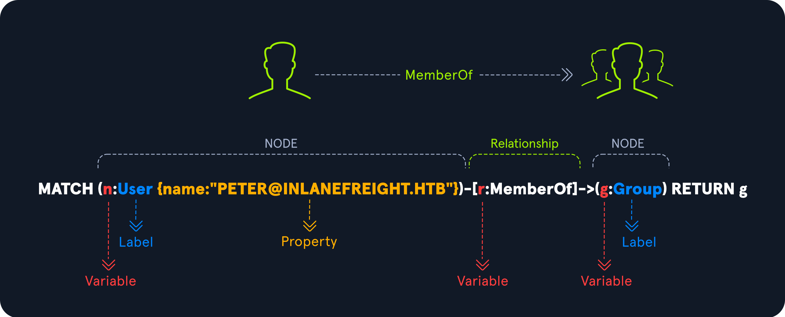

# Cypher Queries

## Language Syntax



| CONCEPT | DESCRIPTION |
|---|---|
| Node | Düğümler veri tabanındaki varlıklardır. Bir düğüm () içinde tanımlanır. |
| Variable | Değişkenler düğümlere referans vermek için kullanılır. |
| Label | Etiketler düğümleri gruplamak için kullanılır. Bir etiket : ile bir değişkene atanır. |
| Property | Özellikler düğümlere ek bilgiler sağlar. Bir özellik {} içinde tanımlanır. Birden fazla özellik belirtmek için virgül kullanılır. |
| Relationship | İlişkiler tek yönlü veya çift yönlü olabilir. Bir ilişki [] içinde tanımlanır. |

## RETURN All Users

```cypher title="Query"
MATCH (u:User)
RETURN u
```

## RETURN a Specific User

```cypher title="Query"
MATCH (u:User {name:"PETER@INLANEFREIGHT.HTB"})
RETURN u
```

## RETURN Group Membership

```cypher title="Query"
MATCH (u:User {name:"PETER@INLANEFREIGHT.HTB"})-[r:MemberOf]->(g:Group)
RETURN u,r,g
```

## BloodHound Raw Query

```cypher title="Query"
MATCH p=(u:User {name:"PETER@INLANEFREIGHT.HTB"})-[r:MemberOf]->(g:Group)
RETURN p
```

## Path Depth

Derinlik bir:

```cypher title="Query"
MATCH p=(u:User {name:"PETER@INLANEFREIGHT.HTB"})-[r:MemberOf*1]->(g:Group)
RETURN p
```

Minimum derinlik bir, maksimum derinlik iki:

```cypher title="Query"
MATCH p=(u:User {name:"PETER@INLANEFREIGHT.HTB"})-[r:MemberOf*1..2]->(g:Group)
RETURN p
```

Sınırsız derinlik:

```cypher title="Query"
MATCH p=(u:User {name:"PETER@INLANEFREIGHT.HTB"})-[r:MemberOf*1..]->(g:Group)
RETURN p
```

## Shortest Path to Domain Admins

```cypher title="Query"
MATCH p=shortestPath((n)-[*1..]->(g:Group {name:"DOMAIN ADMINS@INLANEFREIGHT.HTB"}))
WHERE NOT g=n
RETURN p
```

## Shortest Path to SQL Admin

```cypher title="Query"
MATCH p1=shortestPath((u:User)-[r:MemberOf*1..]->(g:Group))
MATCH p2=(u)-[:SQLAdmin*1..]->(c:Computer)
RETURN p2
```

## Shortest Path to Remote Management Users

```cypher title="Query"
MATCH p1=shortestPath((u:User)-[r:MemberOf*1..]->(g:Group))
MATCH p2=(u)-[:CanPSRemote*1..]->(c:Computer)
RETURN p2
```

## Shortest Path to Remote Desktop Users

```cypher title="Query"
MATCH p1=shortestPath((u:User)-[r:MemberOf*1..]->(g:Group))
MATCH p2=(u)-[:CanRDP*1..]->(c:Computer)
RETURN p2
```

## Group Name CONTAINS a String

```cypher title="Query"
MATCH p=(u:User)-[r:MemberOf*1..]->(g:Group)
WHERE nodes(p)[1].name CONTAINS 'SECURITY'
RETURN p
```

## Custom Queries

Aşağıda verilen sorgu sayesinde Peter kullanıcısı ile ilişkili tüm en kısa yollar bulunabilir:

```cypher title="Query"
MATCH p=allShortestPaths((n)-[*1..]->(c))
WHERE n.name =~ '(?i)peter.*' AND NOT c=n
RETURN p
```

Sorguyu dinamik hale getirmek için aşağıda verilen içeriğe sahip bir dosya oluştur:

```json title="customqueries.json" linenums="1" hl_lines="10 17"
{
    "queries": [
        {
            "name": "From Owned to Anything",
            "category": "Shortest Paths",
            "queryList": [
                {
                    "final": false,
                    "title": "Select the node to search...",
                    "query": "MATCH (n) WHERE n.owned = true RETURN n.name",
                    "props": {
                        "name": ".*"
                    }
                },
                {
                    "final": true,
                    "query": "MATCH p=allShortestPaths((n)-[*1..]->(c)) WHERE n.name = $result AND NOT c=n RETURN p",
                    "allowCollapse": true,
                    "endNode": "{}"
                }
            ]
        }
    ]
}
```
