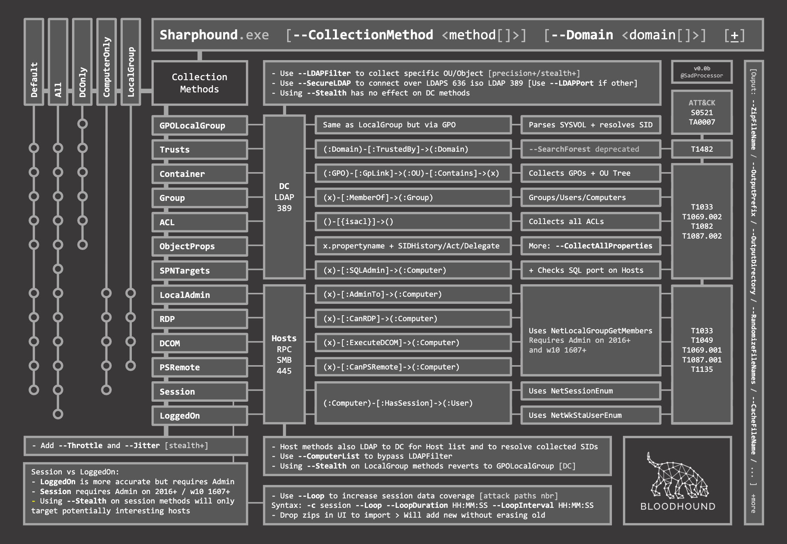

# Data Collection from Windows

## Basic Enumeration

### Domain-Joined

```pwsh
PS C:\Users\htb-student> C:\Tools\SharpHound.exe --zipfilename inlanefreight.zip
```

```output title="Output"
2024-12-02T01:37:02.9609905-06:00|INFORMATION|This version of SharpHound is compatible with the 4.2 Release of BloodHound
2024-12-02T01:37:03.1016245-06:00|INFORMATION|Resolved Collection Methods: Group, LocalAdmin, Session, Trusts, ACL, Container, RDP, ObjectProps, DCOM, SPNTargets, PSRemote
2024-12-02T01:37:03.1329997-06:00|INFORMATION|Initializing SharpHound at 1:37 AM on 12/2/2024
2024-12-02T01:37:51.5234826-06:00|INFORMATION|Flags: Group, LocalAdmin, Session, Trusts, ACL, Container, RDP, ObjectProps, DCOM, SPNTargets, PSRemote
2024-12-02T01:37:51.8360247-06:00|INFORMATION|Beginning LDAP search for INLANEFREIGHT.HTB
2024-12-02T01:37:51.9922492-06:00|INFORMATION|Producer has finished, closing LDAP channel
2024-12-02T01:37:52.0078610-06:00|INFORMATION|LDAP channel closed, waiting for consumers
2024-12-02T01:38:22.0703820-06:00|INFORMATION|Status: 0 objects finished (+0 0)/s -- Using 34 MB RAM
2024-12-02T01:38:52.0860298-06:00|INFORMATION|Status: 0 objects finished (+0 0)/s -- Using 35 MB RAM
2024-12-02T01:39:22.2578983-06:00|INFORMATION|Status: 0 objects finished (+0 0)/s -- Using 36 MB RAM
2024-12-02T01:39:22.5078693-06:00|INFORMATION|Consumers finished, closing output channel
2024-12-02T01:39:22.5547811-06:00|INFORMATION|Output channel closed, waiting for output task to complete
Closing writers
2024-12-02T01:39:22.6953621-06:00|INFORMATION|Status: 141 objects finished (+141 1.566667)/s -- Using 41 MB RAM
2024-12-02T01:39:22.6953621-06:00|INFORMATION|Enumeration finished in 00:01:30.8556782
2024-12-02T01:39:22.7578566-06:00|INFORMATION|Saving cache with stats: 101 ID to type mappings.
 105 name to SID mappings.
 0 machine sid mappings.
 2 sid to domain mappings.
 0 global catalog mappings.
2024-12-02T01:39:22.7578566-06:00|INFORMATION|SharpHound Enumeration Completed at 1:39 AM on 12/2/2024! Happy Graphing!
```

### Workgroup

Hedef domain için DNS isimleri çözülebilir durumda olmalıdır (Internet Protocol Version 4 (TCP/IPv4) Properties):

!!! warning

    Tercih edilen DNS sunucu adresi DC adresi ile aynı olacak şekilde ayarlandı.

* IP address: 172.16.130.231
* Subnet mask: 255.255.255.0
* Preferred DNS server: 172.16.130.3

Kimlik bilgileri bilinen bir domain üyesi ile yeni bir işlem başlat:

```pwsh
PS C:\Users\haris> runas /netonly /user:INLANEFREIGHT\htb-student powershell.exe
```

Kimlik doğrulama işleminin başarılı olup olmadığını test et:

```pwsh
PS C:\Users\htb-student> net view \\INLANEFREIGHT.HTB\
```

```output title="Output"
Shared resources at \\INLANEFREIGHT.HTB\


Share name  Type  Used as  Comment

-------------------------------------------------------------------------------
CertEnroll  Disk           Active Directory Certificate Services share
NETLOGON    Disk           Logon server share
SYSVOL      Disk           Logon server share
The command completed successfully.
```

Artık ilgili domain için toplama yapılabilir:

```pwsh
PS C:\Users\htb-student> C:\Tools\SharpHound.exe --domain INLANEFREIGHT.HTB
```

## Commonly Used Options

| OPTION | DESCRIPTION |
|---|---|
| --collectionmethods | Toplama yöntemi. |
| --ldapusername | LDAP kullanıcı adı. |
| --ldappassword | LDAP parolası. |
| --ldapport | LDAP port numarası. |
| --domain | Hedef domain. |
| --domaincontroller | Hedef DC. |

## Evading Detection

| OPTION | DESCRIPTION |
|---|---|
| --memcache | Önbelleği diske yazmaktan kaçın. |
| --randomfilenames | Rastgele dosya adları kullan. |
| --outputprefix | Çıktı dosya adları için son ek. |
| --outputdirectory | Çıktı dizini. |
| --zipfilename | Arşiv adı. |
| --zippassword | Arşiv parolası. |

## [Collection Methods](https://support.bloodhoundenterprise.io/hc/en-us/articles/17481375424795-All-SharpHound-Community-Edition-Flags-Explained)



| METHOD | DESCRIPTION |
|---|---|
| All | GPOLocalGroup hariç tüm toplama yöntemlerini kullan. |
| DCOnly | Sadece DC için toplama yap. Domain katılımlı bilgisayarlar kullanılmaz. |
| ComputerOnly | Sadece domain katılımlı bilgisayarlar için toplama yap. |

## Session Loop Collection Method

```pwsh
PS C:\Users\htb-student> C:\Tools\SharpHound.exe -c Session --Loop --loopduration 01:00:00 --loopinterval 00:02:00
```

| OPTION | DESCRIPTION |
|---|---|
| --Loop | Aktif oturumları toplamak için bir döngü başlat. |
| --loopduration | Toplam döngü süresi. |
| --loopinterval | Her döngü arası bekleme süresi. |
| --stealth | Sessiz ol. Mümkünse bu seçenek yerine DCOnly toplama yöntemi tercih edilmelidir. |
