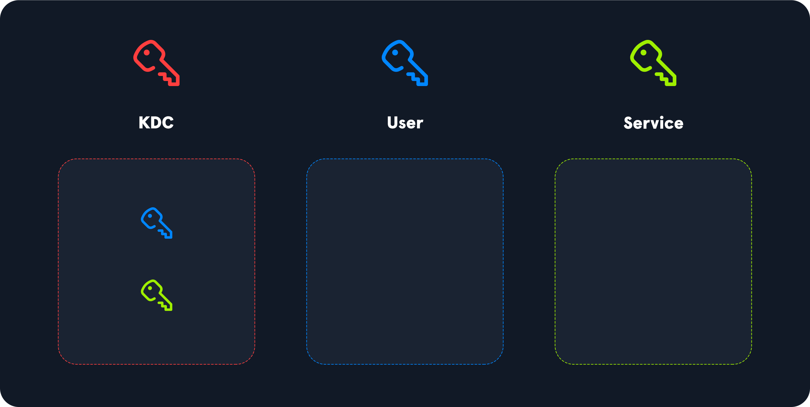
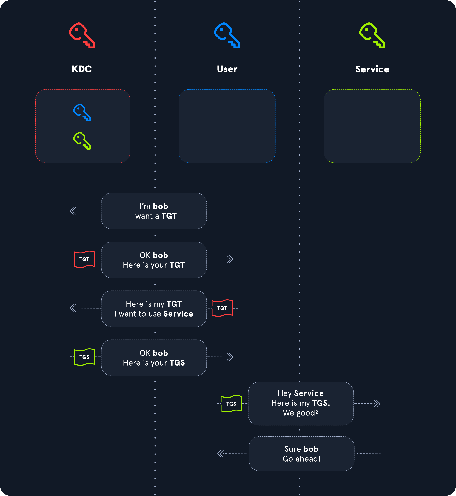
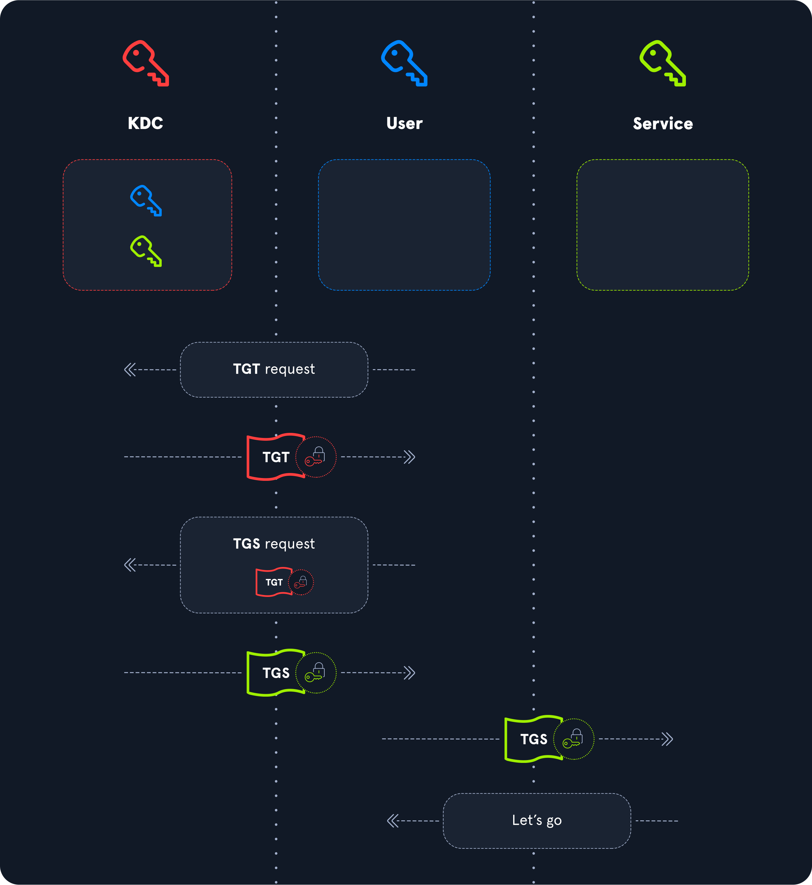
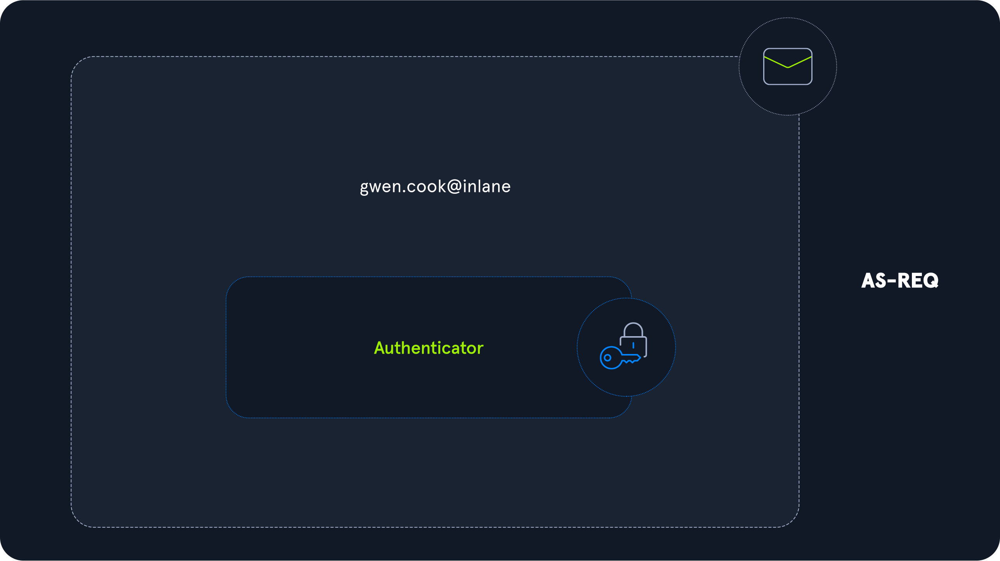
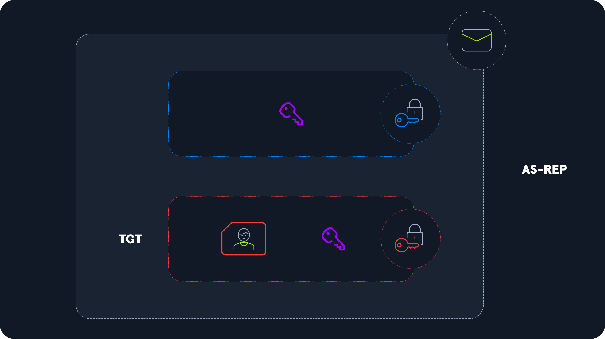
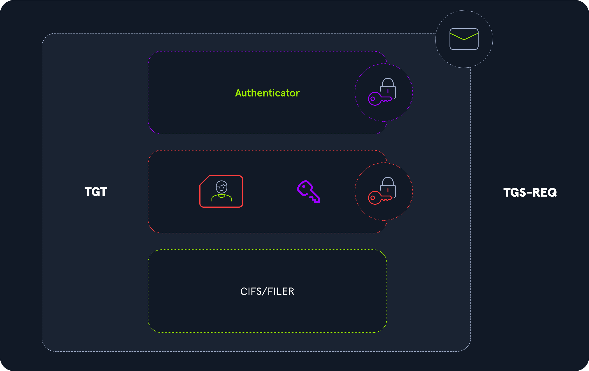
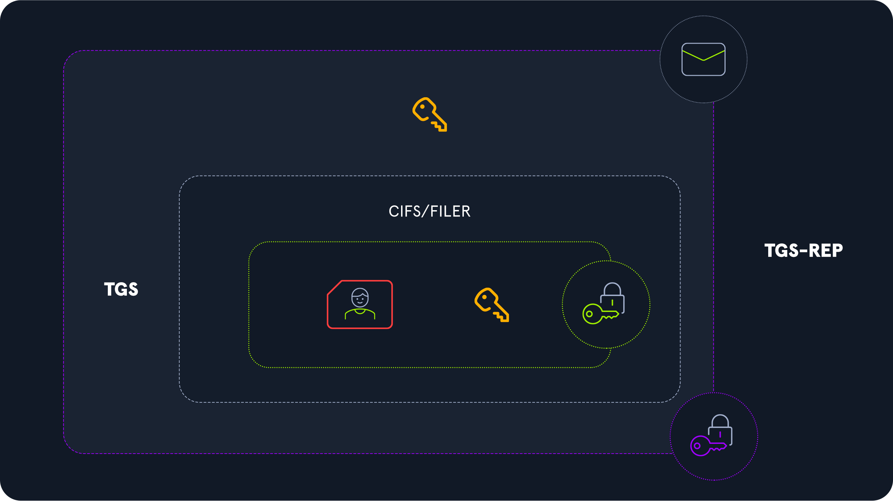
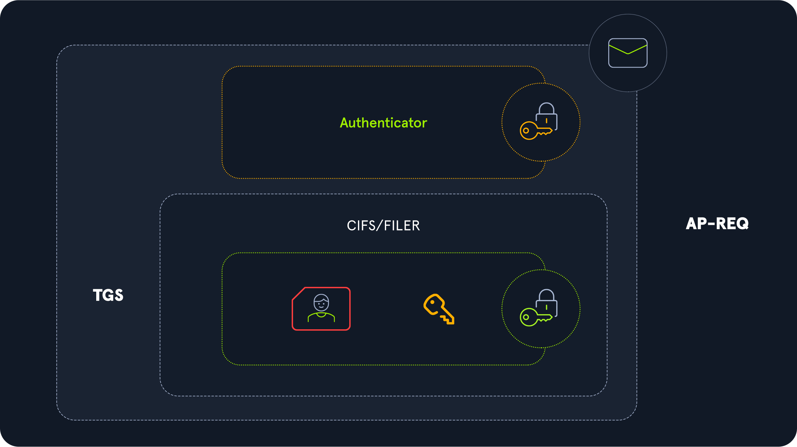

# Kerberos Authentication Process

## Entities

* Key Distribution Center (KDC)
* Kullanıcı
* Servis

## Tickets

1. Kullanıcı KDC üzerinden bir bilet talep eder. Bu bilet Ticket Granting Ticket (TGT) olarak adlandırılır. TGT kullanıcı hakkındaki bilgileri içerir. Bu bilgiler Privilege Attribute Certificate (PAC) içerisinde tutulur.
2. Kullanıcı bir servise erişmek istediği zaman KDC bünyesine TGT sunar. KDC biletin geçerliliğini kontrol eder ve kullanıcıya bir Ticket Granting Service (TGS) bileti sağlar.
3. Kullanıcı erişmek istediği servise TGS bileti sunar. Servis biletin geçerliliğini kontrol eder ve kullanıcı servise erişebilir.

## Ticket Protection

1. TGT, KRBTGT gizli anahtarı ile şifrelenir. Böylece kullanıcı, kendisi hakkındaki bilgileri okuyamaz veya değiştiremez.
2. TGS bileti, servis gizli anahtarı ile şifrelenir. Böylece kullanıcı, TGS bileti içerisinde yer alan bilgiler için bir değişiklik yapamaz.

## Authentication Service (AS)

### AS-REQ

!!! warning

    Bu aşama pre-authentication olarak adlandırılır. Devre dışı bırakılması durumunda doğrulayıcı kullanılmaz.

Kullanıcı, kimliğini ispat etmek için AS-REQ talebine aşağıda verilen bilgileri ekler:

* Kullanıcı adı.
* Doğrulayıcı. Kullanıcının kendi gizli anahtarı ile şifrelediği anlık zaman damgasıdır.

KDC, kullanıcıya ait gizli anahtarı bünyesinde bulunan anahtar dizininde araştırır ve bulduğu anahtar ile doğrulayıcı şifresini çözer.

### AS-REP

Kullanıcı ile KDC arasında bir oturum anahtarı oluşturulur. Haberleşmeyi güvence altına almak için bu anahtar kullanılır. Kerberos [stateless](https://en.wikipedia.org/wiki/Stateless_protocol) bir protokol olduğu için bu anahtar herhangi bir yerde saklanmaz.

AS-REP yanıtı aşağıda verilen kısımlardan oluşur:

* Oturum anahtarı. Kullanıcı gizli anahtarı ile korunur.
* TGT. KRBTGT gizli anahtarı ile korunur. PAC ve kopya oturum anahtarı içerir.

## Ticket Granting Service (TGS)

### TGS-REQ

* Doğrulayıcı. Oturum anahtarı ile korunur.
* TGT. KRBTGT gizli anahtarı ile korunur.
* Service Principal Name (SPN). Erişilecek olan servis adını ifade eder.

### TGS-REP

!!! warning

    TGS-REQ talebindeki doğrulayıcı geçerliliği TGT içerisinde bulunan kopya oturum anahtarı ile kontrol edilir.

Kullanıcı ile servis arasında yeni bir oturum anahtarı oluşturulur.

TGS bileti aşağıda verilen kısımlardan oluşur:

* SPN.
* PAC. Servis gizli anahtarı ile korunur.
* Kopya oturum anahtarı. Servis gizli anahtarı ile korunur.

Tüm bu bilgiler kullanıcı ile KDC arasındaki oturum anahtarı ile korunur.

## Application Request (AP)

### AP-REQ

* Doğrulayıcı. Oturum anahtarı ile korunur.
* TGS bileti.

### AP-REP

!!! warning

    AP-REQ talebindeki doğrulayıcı geçerliliği TGS bileti içerisinde bulunan kopya oturum anahtarı ile kontrol edilir.

1. Oturum anahtarı ile şifrelenmiş bir doğrulayıcı AP-REP yanıtına eklenerek kullanıcıya gönderilir.
2. Kullanıcı yanıtın servisten geldiğini doğrular ve servise erişebilir.
