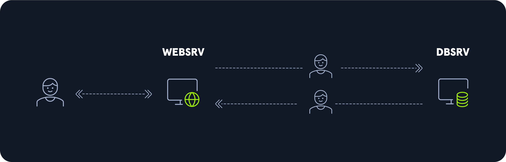
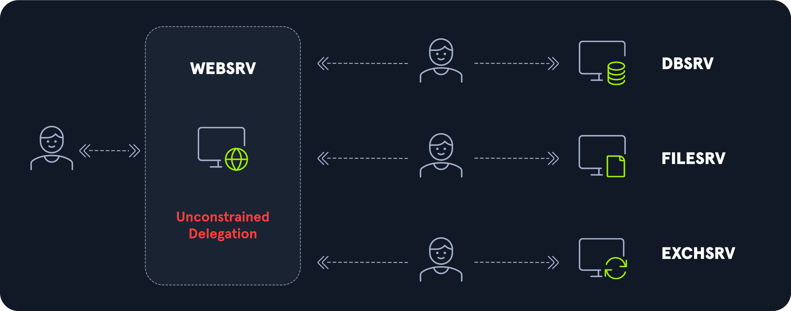
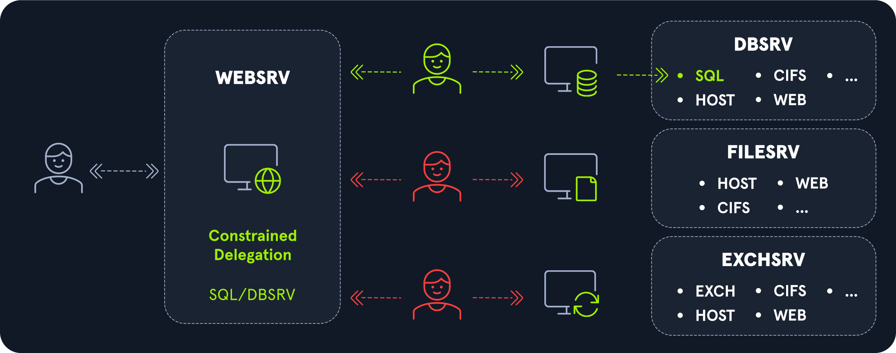
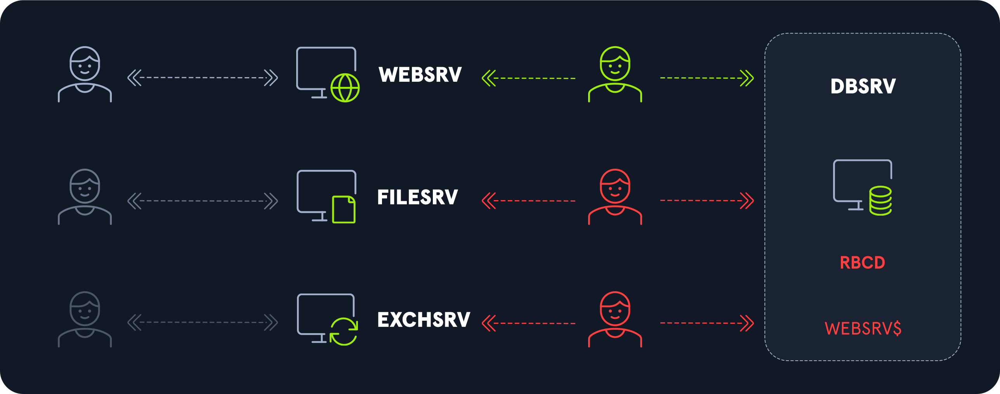

# Kerberos Delegations

## Introduction

* Kullanıcı web sitesine erişmek için WEBSRV üzerinde kimlik doğrulaması yapar.
* Web sitesine erişen kullanıcı veri tabanı ile etkileşime girmek ister, ancak erişim hakları sınırlıdır.
* Bunun yerine WEBSRV$ servis hesabı veri tabanı ile etkileşime girmek için kullanıcı adına hareket eder.

## Unconstrained Delegation

!!! warning

    Bir hesapta kısıtlanmamış delegasyon ayarlamak için [SeEnableDelegation](https://learn.microsoft.com/en-us/previous-versions/windows/it-pro/windows-10/security/threat-protection/security-policy-settings/enable-computer-and-user-accounts-to-be-trusted-for-delegation) ayrıcalığı gereklidir.

Kısıtlanmamış delegasyon bir servisin başka HERHANGİ BİR SERVİSE erişirken bir kullanıcının kimliğine bürünmesine olanak tanır.

* Kullanıcı, kısıtlanmamış delegasyon servisine erişmek için DC üzerinden bir TGS bileti talep eder.
* DC, kullanıcıya ait TGT kopyasını TGS biletine ekler ve kullanıcıya gönderir.
* Kullanıcı, DC tarafından gönderilen TGS biletini kullanarak kısıtlanmamış delegasyon servisine erişir.
* Kısıtlanmamış delegasyon servisi kullanıcıya ait TGT kopyasını çıkarabilir ve bu bilgiyi kullanarak kullanıcı adına herhangi bir servise erişmek için DC üzerinden TGS bileti talep edebilir.

| PROPERTY FLAG | HEXADECIMAL | DECIMAL |
|---|---|---|
| TRUSTED_FOR_DELEGATION | 0x80000 | 524288 |

* [ ] Do not trust this computer for delegation
* [x] Trust this computer for delegation to any service (Kerberos only)
* [ ] Trust this computer for specified services only

## Constrained Delegation

!!! warning

    DC, kullanıcıya ait TGT kopyasını TGS biletine eklemez.

Kısıtlanmış delegasyon bir servisin DAHA ÖNCEDEN BELİRLENMİŞ SERVİSLERE erişirken bir kullanıcının kimliğine bürünmesine olanak tanır.

Bu seçenek aktif hale getirildiğinde izin verilen servis listesi servis hesabına ait [msDS-AllowedToDelegateTo](https://learn.microsoft.com/en-us/windows/win32/adschema/a-msds-allowedtodelegateto) niteliği içerisinde tutulur.

* [ ] Do not trust this computer for delegation
* [ ] Trust this computer for delegation to any service (Kerberos only)
* [x] Trust this computer for specified services only

### S4U2proxy

| PROPERTY FLAG | HEXADECIMAL | DECIMAL |
|---|---|---|
| No Change | No Change | No Change |

[Service for User to Proxy](https://learn.microsoft.com/en-us/openspecs/windows_protocols/ms-sfu/bde93b0e-f3c9-4ddf-9f44-e1453be7af5a) uzantısı aşağıdaki seçeneğe karşılık gelir:

* [x] Use Kerberos only
* [ ] Use any authentication protocol

Bir servis hesabı bir kaynağa erişmek istediğinde bir kullanıcı adına kendisi için bir TGS bileti talep eder.

Klasik TGS biletinden farklı olarak talep edilen biletin 2 alanı üzerinde değişiklik yapılır:

1. Additional Tickets alanına kullanıcıya ait TGS biletinin bir kopyası eklenir.
2. Ek olarak [CNAME-IN-ADDL-TKT](https://learn.microsoft.com/en-us/openspecs/windows_protocols/ms-sfu/17b9af82-d45a-437d-a05c-79547fe969f5) bayrağı ayarlanır. Bu sayede DC, sunucu bilgisi yerine Additional Tickets alanında bulunan bilet bilgisini kullanır.

### S4U2self

| PROPERTY FLAG | HEXADECIMAL | DECIMAL |
|---|---|---|
| TRUSTED_TO_AUTH_FOR_DELEGATION | 0x1000000 | 16777216 |

[Service for User to Self](https://learn.microsoft.com/en-us/openspecs/windows_protocols/ms-sfu/02636893-7a1f-4357-af9a-b672e3e3de13) uzantısı aşağıdaki seçeneğe karşılık gelir:

* [ ] Use Kerberos only
* [x] Use any authentication protocol

Bir servis hesabı S4U2proxy [KRB_TGS_REQ](https://learn.microsoft.com/en-us/windows/win32/secauthn/ticket-granting-service-exchange) mesajında kullanmak üzere bir kullanıcı adına kendisi için [forwardable](https://learn.microsoft.com/en-us/openspecs/windows_protocols/ms-sfu/4a624fb5-a078-4d30-8ad1-e9ab71e0bc47#gt_4c6cd79b-120d-4ee1-ab24-d1b000e0b3ca) bir TGS bileti talep eder.

Bu sayede farklı protokoller arası delegasyon mümkün hale gelir (protocol transition).

## Resource-Based Constrained Delegation

!!! warning

    DC, kullanıcıya ait TGT kopyasını TGS biletine eklemez.

Kaynak tabanlı kısıtlanmış delegasyon KAYNAK SEVİYESİNDE bir güven listesi tanımlar. Bu listede bulunan hesaplar bir kullanıcının kimliğine bürünebilir.

Bir servis hesabı bir veya daha fazla hesabı kendi güven listesine eklemek istediğinde [msDS-AllowedToActOnBehalfOfOtherIdentity](https://learn.microsoft.com/en-us/windows/win32/adschema/a-msds-allowedtoactonbehalfofotheridentity) niteliğini günceller.

Bu örnekte DBSRV bilgisayarının güven listesinde sadece WEBSRV$ servis hesabı bulunmaktadır.

Bu sebeple WEBSRV$ servis hesabı bir kullanıcının kimliğine bürünmek istediğinde kullanıcının DBSRV üzerindeki kaynaklara erişmesine izin verilir.
