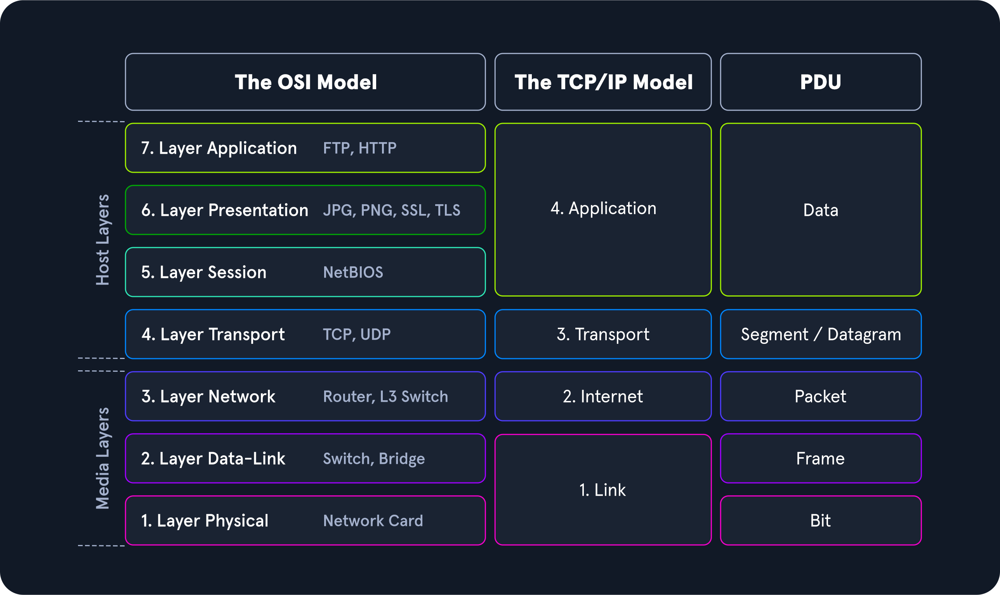

# Data Flow Example

## Connection

1. Kullanıcı, WLAN SSID bilgisi ile ağa bağlanır.
2. Kullanıcı, ağ parolası ile kimlik doğrulaması gerçekleştirir.

## DHCP [DORA](https://en.wikipedia.org/wiki/Dynamic_Host_Configuration_Protocol#Operation)

1. DHCP istemcisi --> [DHCPDISCOVER](https://en.wikipedia.org/wiki/Dynamic_Host_Configuration_Protocol#Discovery) --> DHCP sunucusu
2. DHCP sunucusu --> [DHCPOFFER](https://en.wikipedia.org/wiki/Dynamic_Host_Configuration_Protocol#Offer) --> DHCP istemcisi
3. DHCP istemcisi --> [DHCPREQUEST](https://en.wikipedia.org/wiki/Dynamic_Host_Configuration_Protocol#Request) --> DHCP sunucusu
4. DHCP sunucusu --> [DHCPACK](https://en.wikipedia.org/wiki/Dynamic_Host_Configuration_Protocol#Acknowledgement) --> DHCP istemcisi

## DNS

1. Web tarayıcısı, kullanıcı tarafından başlatılır.
2. Web tarayıcısı, URL çubuğuna girilen web sitesini ziyaret etmeyi dener.
3. [DNS çözümleme](https://www.solarwinds.com/resources/it-glossary/dns-resolution) işlemi başlar:
    * Yerel sistemde bulunan DNS önbelleği kontrol edilir.
    * Yerel sistemde bilinen herhangi bir IP adresi mevcut değil ise Recursive ad sunucusu (ISP, Google) için bir sorgu yapılır.
    * Recursive ad sunucusu, [Root ad sunucusu](https://en.wikipedia.org/wiki/Root_name_server) (.) ile iletişime geçer.
    * Root ad sunucusu, [Top-Level Domain](https://en.wikipedia.org/wiki/Top-level_domain) ad sunucusu (.org) ile iletişime geçer.
    * TLD ad sunucusu, Authoritative ad sunucusu ile iletişime geçer.
    * Authoritative ad sunucusu, web sitesine ait IP adresi ile yanıt verir.
    * Recursive ad sunucusu, öğrenilen IP adresi ile yanıt verir.

## Data Encapsulation

### TCP/IP Application

1. Web sitesine ait IP adresi, DNS ile öğrenildi.
2. Web tarayıcısı, web sitesi için bir HTTP/HTTPS isteği oluşturdu.

### TCP/IP Transport

1. HTTP/HTTPS isteği, bir TCP segment içerisine sarıldı.
2. TCP segment:
    * SRC: PC port numarası
    * DST: Web sitesi port numarası (80/443)

### TCP/IP Internet

1. TCP segment, bir IP paketi içerisine yerleştirildi.
2. IP paketi:
    * SRC: PC özel IP adresi (192.168.1.10)
    * DST: Web sitesi açık IP adresi (93.184.216.34)

### TCP/IP Link

1. IP paketi, Ethernet/Wi-Fi çerçevesi içerisine yerleştirildi.
2. Ethernet/Wi-Fi çerçevesi:
    * SRC: PC MAC adresi
    * DST: Router MAC adresi (ARP ile öğrenildi)

## NAT

### To Server

1. PC özel IP adresi (192.168.1.10)
2. Router açık IP adresi (203.0.113.45)
3. Web sitesi açık IP adresi (93.184.216.34)

### To PC

1. Web sitesi açık IP adresi (93.184.216.34)
2. Router açık IP adresi (203.0.113.45)
3. PC özel IP adresi (192.168.1.10)

## Server Response

1. Güvenlik duvarı, HTTP/HTTPS port kuralını kontrol eder.
2. Güvenlik duvarı, web sitesini barındıran web sunucusuna geçiş izni verir.
3. Web sunucusu yazılımı (Apache, IIS) web sayfası (HTML, CSS) ile yanıt verir.
