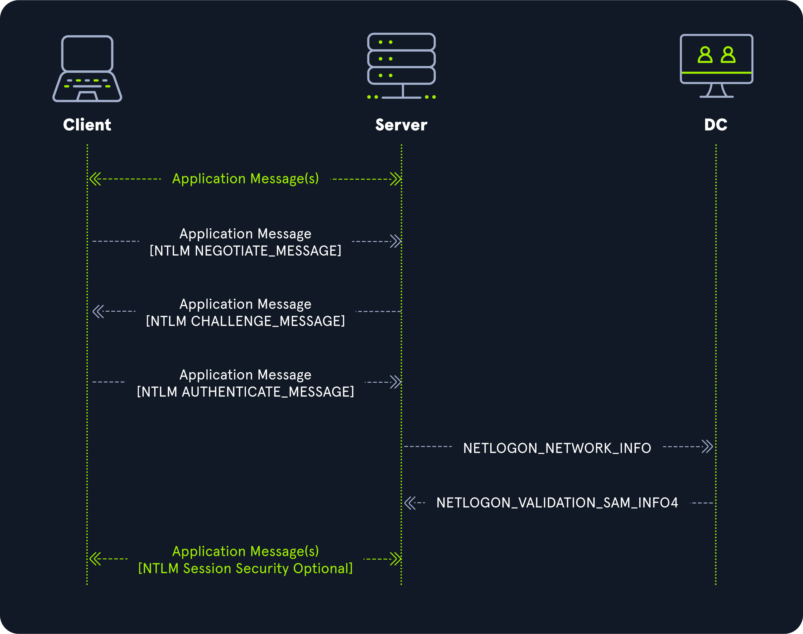
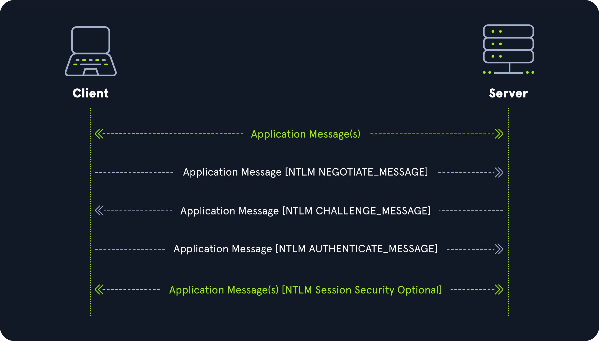

# Introduction

## NTLM Authentication Protocol

### Domain-Joined

!!! abstract

    Kullanıcı kimlik doğrulamasını DC gerçekleştirir. SUNUCU ile DC arası [pass-through](https://learn.microsoft.com/en-us/openspecs/windows_protocols/ms-nrpc/70697480-f285-4836-9ca7-7bb52f18c6af) delegasyon.

### Workgroup

!!! abstract

    Kullanıcı kimlik doğrulamasını SUNUCU gerçekleştirir.

## NTLM Messages

1. [NEGOTIATE_MESSAGE](https://learn.microsoft.com/en-us/openspecs/windows_protocols/ms-nlmp/b34032e5-3aae-4bc6-84c3-c6d80eadf7f2)
2. [CHALLENGE_MESSAGE](https://learn.microsoft.com/en-us/openspecs/windows_protocols/ms-nlmp/801a4681-8809-4be9-ab0d-61dcfe762786)
3. [AUTHENTICATE_MESSAGE](https://learn.microsoft.com/en-us/openspecs/windows_protocols/ms-nlmp/033d32cc-88f9-4483-9bf2-b273055038ce)

## SMB Signing

| HOST | DEFAULT SETTING |
|---|---|
| SMB1 (istemci) | Etkin |
| SMB1 (sunucu) | Etkin değil |
| SMB2 ve SMB3 (istemci) | Zorunlu değil |
| SMB2 ve SMB3 (sunucu) | Zorunlu değil |
| DC | Zorunlu |
