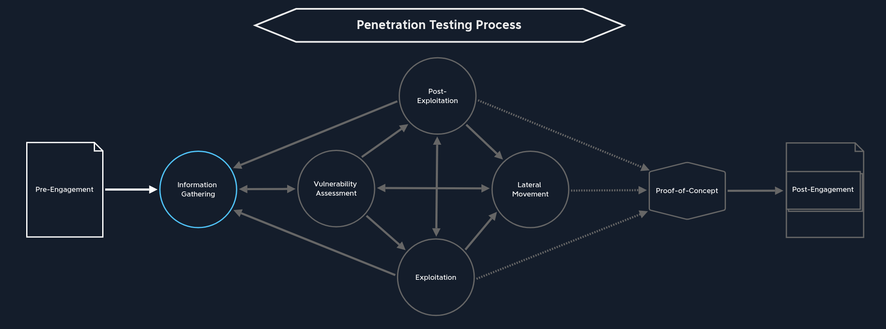
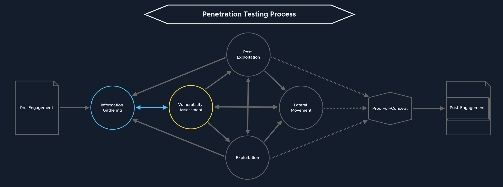
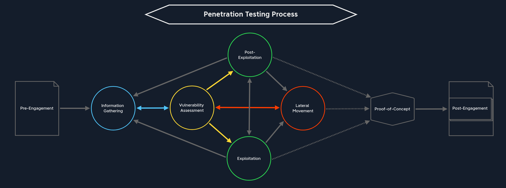
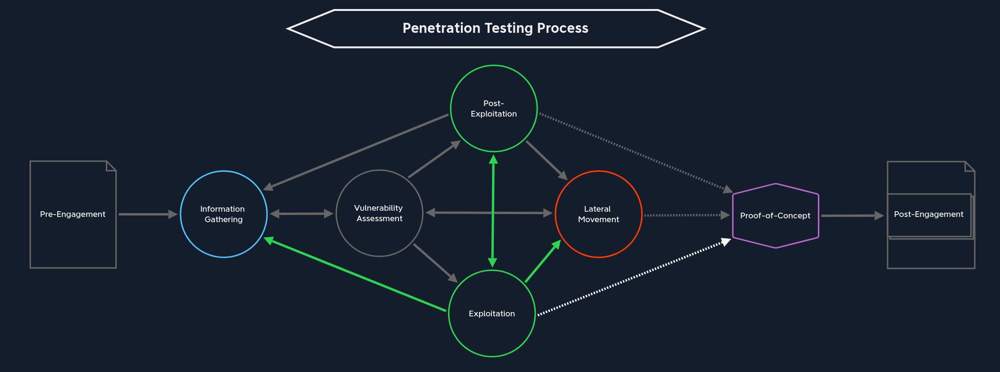
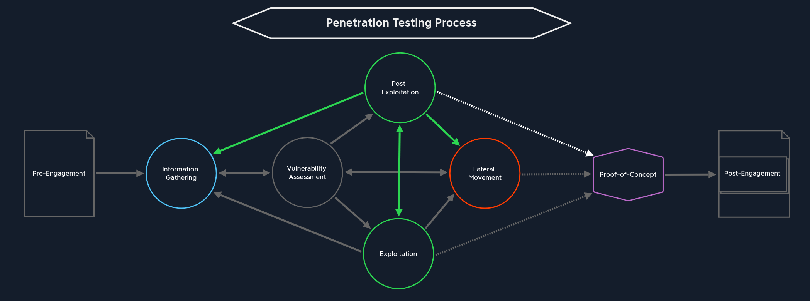
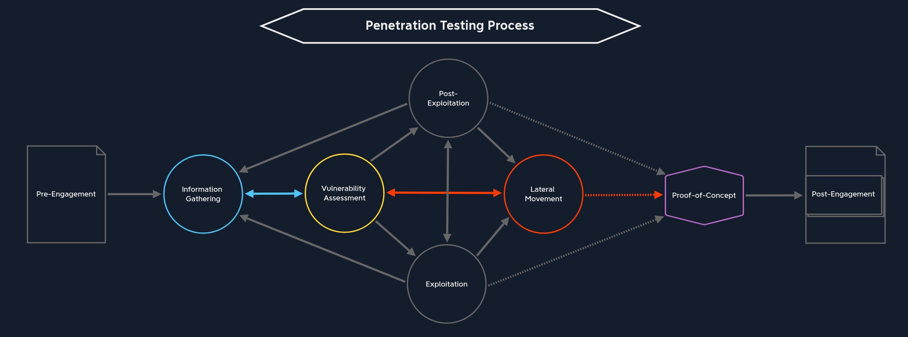
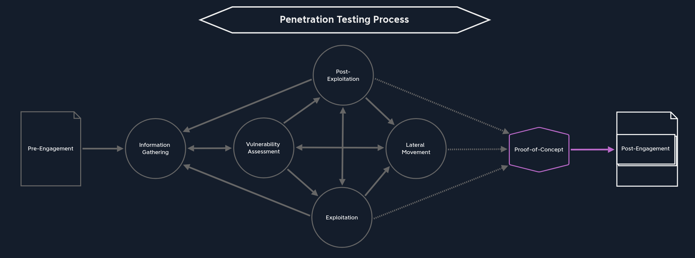

# Process

## Pre-Engagement

| NEXT PATH |
|---|
| Information Gathering |

## Information Gathering

| NEXT PATH |
|---|
| Vulnerability Assessment |

## Vulnerability Assessment

| NEXT PATH |
|---|
| Exploitation |
| Post-Exploitation |
| Lateral Movement |
| Information Gathering |

## Exploitation

| NEXT PATH |
|---|
| Post-Exploitation |
| Lateral Movement |
| Information Gathering |
| Proof-of-Concept |

## Post-Exploitation

| NEXT PATH |
|---|
| Lateral Movement |
| Proof-of-Concept |
| Information Gathering |
| Exploitation |

## Lateral Movement

| NEXT PATH |
|---|
| Proof-of-Concept |
| Information Gathering |
| Vulnerability Assessment |

## Proof-of-Concept

| NEXT PATH |
|---|
| Post-Engagement |
