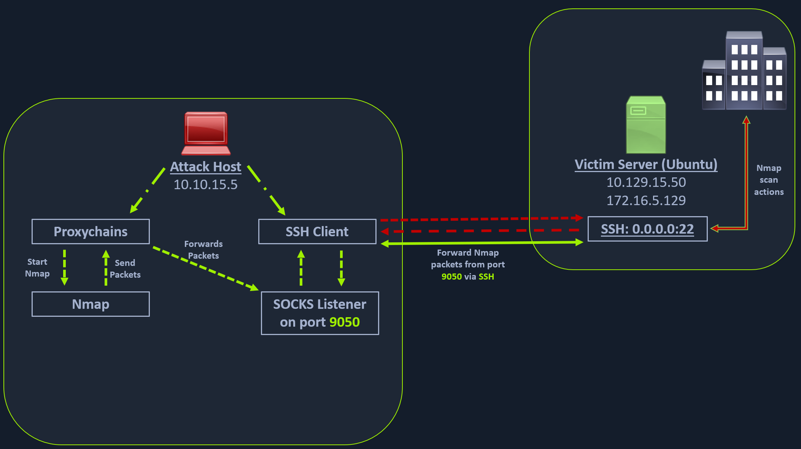

# SSH Dynamic Port Forwarding

## Scenario



1. Saldırı bilgisayarı (SSH istemcisi), Ubuntu sunucusu (SSH sunucusu) aracılığı ile bir <span style="color:red">yönlendirme</span> (-D) talep eder:
    * localhost:9050
2. SSH istemcisi, localhost:9050 adresi üzerinde dinlemeye başlar.
3. Proxychains, 172.16.5.0/23 ağı için <span style="color:green">gönderilen</span> paketleri ilk önce SOCKS sunucusuna <span style="color:green">iletir</span>.
4. SOCKS sunucusu, Proxychains tarafından gönderilen paketleri SSH sunucusuna <span style="color:green">iletir</span>.

## Forwarding

```sh
my@attack:~$ ssh -D localhost:9050 ubuntu@10.129.15.50
```

## [FoxyProxy](https://getfoxyproxy.org/)

!!! failure

    Eklenti için Proxy DNS devre dışı olmalıdır.

    Aksi halde Temporary failure in name resolution hatası alınabilir:

    ```output title="Output"
    channel 2: open failed: connect failed: Temporary failure in name resolution
    debug1: channel 2: free: direct-tcpip: listening port 9050 for www.google.com port 443, connect from 127.0.0.1 port 40930 to 127.0.0.1 port 9050, nchannels 10
    channel 6: open failed: connect failed: Temporary failure in name resolution
    debug1: channel 6: free: direct-tcpip: listening port 9050 for www.google.com port 443, connect from 127.0.0.1 port 40936 to 127.0.0.1 port 9050, nchannels 11
    ```

* SOCKS5
* 127.0.0.1
* 9050

## Proxychains Configuration File

```sh
my@attack:~$ tail /etc/proxychains.conf
```

```ini title="Output" hl_lines="9"
#       proxy types: http, socks4, socks5, raw
#         * raw: The traffic is simply forwarded to the proxy without modification.
#        ( auth types supported: "basic"-http  "user/pass"-socks )
#
[ProxyList]
# add proxy here ...
# meanwile
# defaults set to "tor"
socks5 127.0.0.1 9050
```

## Test Scan

!!! warning

    Proxychains kısmi paketleri anlamaz, bu sebeple Nmap tarama türü olarak [TCP Connect taraması](https://nmap.org/book/scan-methods-connect-scan.html) tercih edilmelidir.

```sh
my@attack:~$ proxychains -q nmap 172.16.5.19 -sT -Pn
```

```output title="Output"
Starting Nmap 7.95 ( https://nmap.org ) at 2025-04-29 20:37 +03
Nmap scan report for 172.16.5.19
Host is up (0.073s latency).
Not shown: 986 closed tcp ports (conn-refused)
PORT     STATE SERVICE
53/tcp   open  domain
80/tcp   open  http
88/tcp   open  kerberos-sec
135/tcp  open  msrpc
139/tcp  open  netbios-ssn
389/tcp  open  ldap
445/tcp  open  microsoft-ds
464/tcp  open  kpasswd5
593/tcp  open  http-rpc-epmap
636/tcp  open  ldapssl
3268/tcp open  globalcatLDAP
3269/tcp open  globalcatLDAPssl
3389/tcp open  ms-wbt-server
5985/tcp open  wsman

Nmap done: 1 IP address (1 host up) scanned in 97.06 seconds
```

## Metasploit Framework

```sh
my@attack:~$ proxychains -q msfconsole -q
```

```sh
msf6 > use auxiliary/scanner/rdp/rdp_scanner
msf6 auxiliary(scanner/rdp/rdp_scanner) > set RHOSTS 172.16.5.19
msf6 auxiliary(scanner/rdp/rdp_scanner) > run
```

```output title="Output"
[*] 172.16.5.19:3389      - Detected RDP on 172.16.5.19:3389      (name:DC01) (domain:INLANEFREIGHT) (domain_fqdn:inlanefreight.local) (server_fqdn:DC01.inlanefreight.local) (os_version:10.0.17763) (Requires NLA: No)
[*] 172.16.5.19:3389      - Scanned 1 of 1 hosts (100% complete)
[*] Auxiliary module execution completed
```

## xFreeRDP

```sh
my@attack:~$ proxychains -q xfreerdp /v:172.16.5.19 /u:'victor' /p:'pass@123'
```
