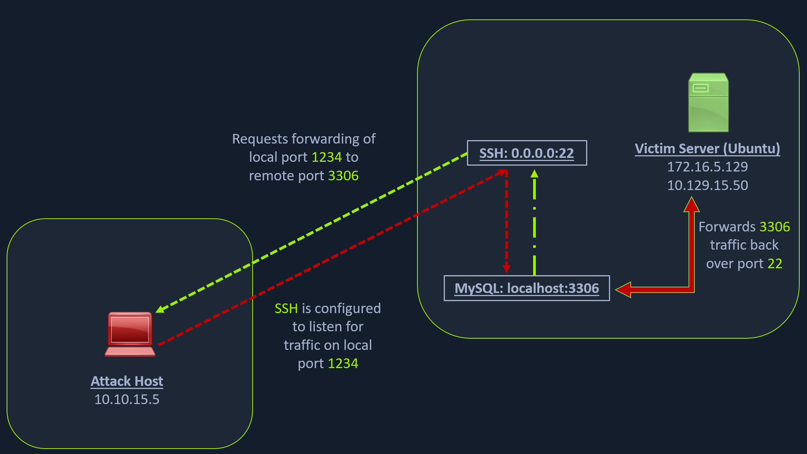

# SSH Local Port Forwarding

## Scanning the Pivot

```sh
my@attack:~$ sudo nmap 10.129.15.50 -p 22,3306 -sT
```

```output title="Output" hl_lines="6"
Starting Nmap 7.95 ( https://nmap.org ) at 2025-04-29 20:26 +03
Nmap scan report for 10.129.15.50
Host is up (0.059s latency).

PORT     STATE  SERVICE
22/tcp   open   ssh
3306/tcp closed mysql

Nmap done: 1 IP address (1 host up) scanned in 0.29 seconds
```

## Scenario



1. Saldırı bilgisayarı (SSH istemcisi), Ubuntu sunucusu (SSH sunucusu) aracılığı ile bir yönlendirme (-L) talep eder:
    * localhost:1234
    * localhost:3306
2. SSH istemcisi, localhost:1234 adresi üzerinde dinlemeye başlar.
3. SSH istemcisi, localhost:1234 adresi için gönderilen paketleri SSH sunucusuna <span style="color:red">iletir</span>.
4. SSH sunucusu, SSH istemcisi tarafından gönderilen paketleri MySQL tarafına <span style="color:red">iletir</span>.
5. SSH sunucusu, MySQL tarafından geri <span style="color:green">gönderilen</span> paketleri SSH istemcisine <span style="color:green">iletir</span>.

## Forwarding

```sh
my@attack:~$ ssh -L localhost:1234:localhost:3306 ubuntu@10.129.15.50
```

## Forwarding Multiple Ports

```sh
my@attack:~$ ssh -L localhost:1234:localhost:3306 -L localhost:8080:localhost:80 ubuntu@10.129.15.50
```

## Confirmation

### SS

```sh
my@attack:~$ sudo ss -antp | grep 1234
```

```output title="Output"
LISTEN    0      128        127.0.0.1:1234          0.0.0.0:*    users:(("ssh",pid=49308,fd=5))
LISTEN    0      128            [::1]:1234             [::]:*    users:(("ssh",pid=49308,fd=4))
```

### Nmap

```sh
my@attack:~$ sudo nmap localhost -p 1234 -sV
```

```output title="Output" hl_lines="7"
Starting Nmap 7.95 ( https://nmap.org ) at 2025-04-29 20:27 +03
Nmap scan report for localhost (127.0.0.1)
Host is up (0.000077s latency).
Other addresses for localhost (not scanned): ::1

PORT     STATE SERVICE VERSION
1234/tcp open  mysql   MySQL 8.0.28-0ubuntu0.20.04.3

Service detection performed. Please report any incorrect results at https://nmap.org/submit/ .
Nmap done: 1 IP address (1 host up) scanned in 0.54 seconds
```
