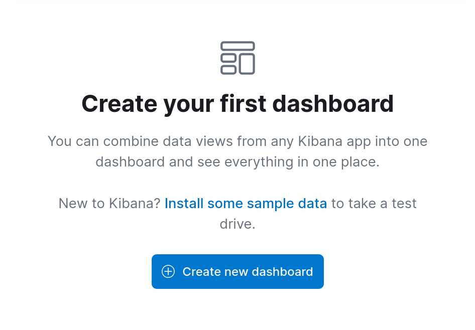
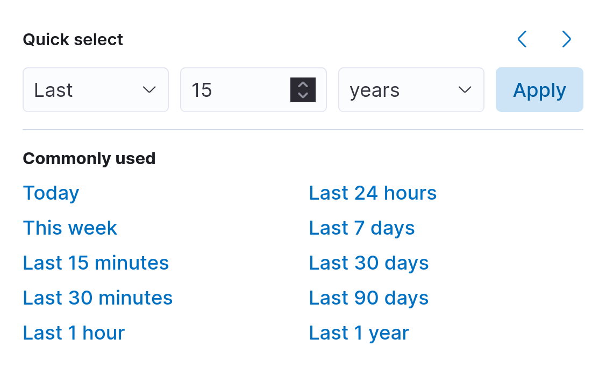
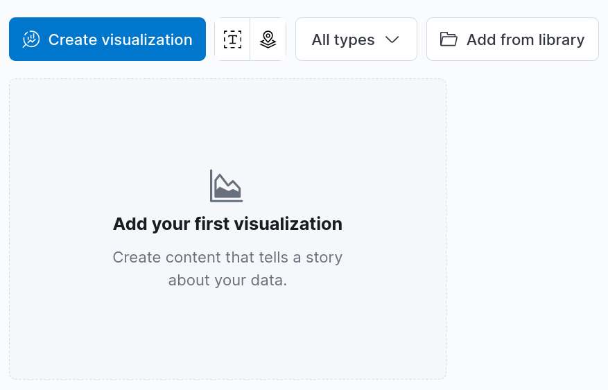
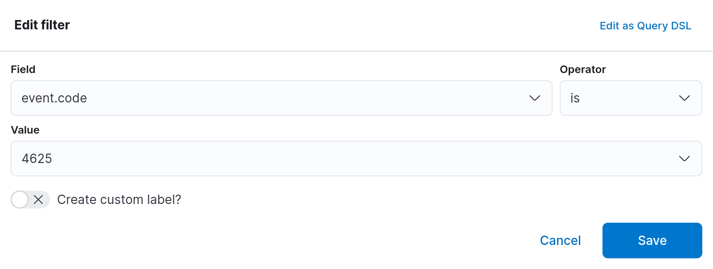
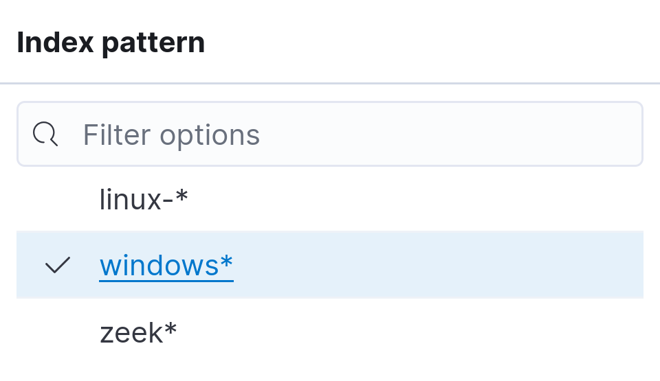
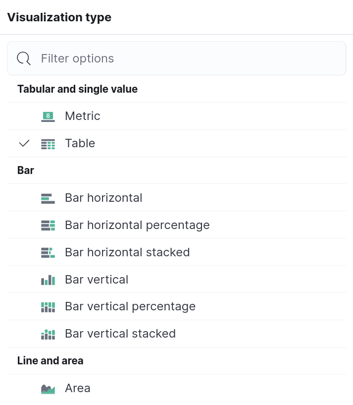
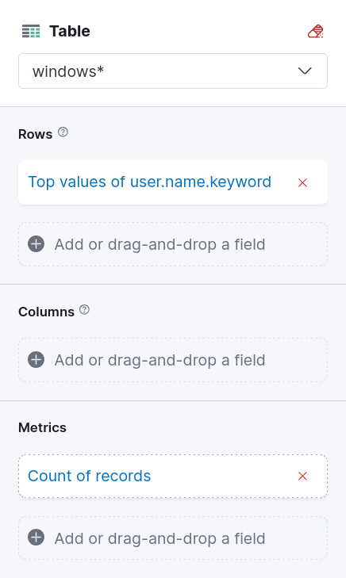
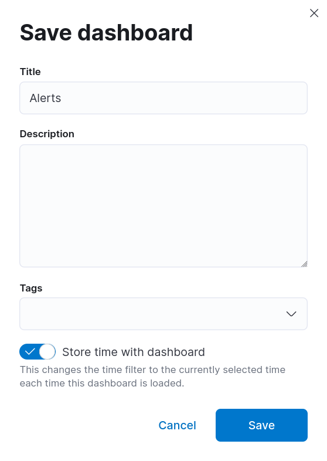

# Kibana Dashboards

## Create New Dashboard

## Date Range

## Create Visualization

### Add Filter

### Index Pattern

### Visualization Type

### Table

### Save and Return

## Save

## Save Dashboard

